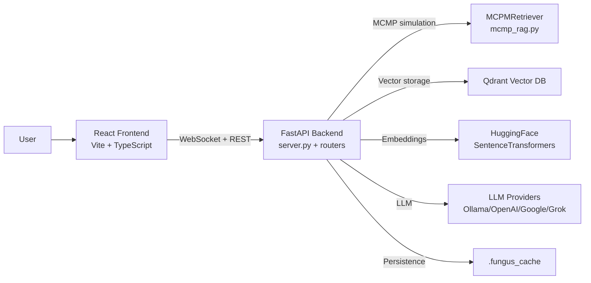
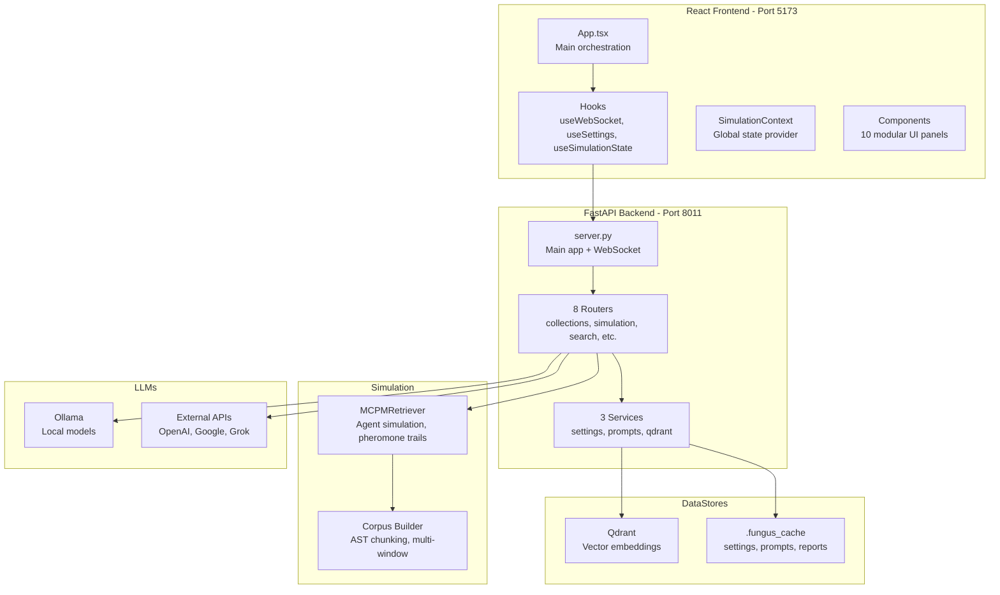
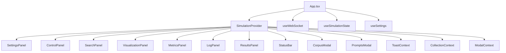

# Architecture Documentation

This document describes the modular architecture of the LA Fungus Search system, following C4 model conventions (Context, Container, Component, Code).

## Overview

The system is a **FastAPI + React** application for mycelial code search using MCMP (Multi-Colony Multi-Pheromone) simulation. The architecture has been refactored to be highly modular with clear separation of concerns:

- **Backend**: Python/FastAPI with routers, services, and dependency injection
- **Frontend**: React/TypeScript with hooks, context, and component-based UI
- **Storage**: Qdrant vector database (or in-memory fallback) for embeddings
- **LLM**: Pluggable LLM providers (Ollama, OpenAI, Google, Grok) for reports and steering

---

## C4: System Context (Level 1)



**Key Points:**
- React frontend (port 5173) communicates with FastAPI backend (port 8011)
- Real-time updates via WebSocket (`/ws`) for simulation snapshots and metrics
- REST endpoints for control, search, corpus management, and settings
- MCMP simulation explores code with agent-based pheromone trails
- Qdrant stores code chunk embeddings; in-memory mode available for testing
- Settings, prompts, and reports persisted to `.fungus_cache/`

---

## C4: Container (Level 2)



**Container Responsibilities:**

**Frontend:**
- React app with Vite dev server
- TypeScript for type safety
- Custom hooks for WebSocket, settings, and simulation state
- Context API for global state management
- 10 modular components for UI sections

**Backend:**
- FastAPI server with async/await
- 8 routers for endpoint organization (32 endpoints total)
- 3 services for core logic (settings, prompts, qdrant)
- Dependency injection for shared state (streamer)
- WebSocket streaming for real-time updates

**Simulation:**
- MCPMRetriever orchestrates agent-based exploration
- Agents move through embedding space following pheromone trails
- Multi-window chunking strategy (e.g., 1000, 2000, 4000 lines)

**Data Stores:**
- Qdrant for persistent vector storage
- `.fungus_cache/` for settings, prompts, and reports (JSON)

**LLMs:**
- Pluggable providers via dispatcher
- Ollama for local inference
- External APIs for cloud models

---

## C4: Component (Level 3) - Backend

### Backend File Structure

```
src/embeddinggemma/realtime/
├── server.py                 # Main FastAPI app (1,288 lines)
├── routers/
│   ├── __init__.py
│   ├── collections.py        # Qdrant collection management (273 lines)
│   ├── simulation.py         # Simulation control endpoints (376 lines)
│   ├── search.py             # Search and answer endpoints (122 lines)
│   ├── agents.py             # Agent control endpoints (98 lines)
│   ├── settings.py           # Settings get/post endpoints (50 lines)
│   ├── prompts.py            # Prompt management endpoints (53 lines)
│   ├── corpus.py             # Corpus listing and indexing (320 lines)
│   └── misc.py               # Misc endpoints (introspect, jobs, etc.) (180 lines)
└── services/
    ├── __init__.py
    ├── settings_manager.py   # Settings persistence and validation (337 lines)
    ├── prompts_manager.py    # Prompt template management (122 lines)
    └── qdrant_service.py     # Qdrant client wrapper (262 lines)
```

### Router Organization

**Collections Router** (`/collections`)
- `GET /collections/list` - List all Qdrant collections
- `POST /collections/switch` - Switch active collection
- `GET /collections/{name}/info` - Get collection metadata
- `DELETE /collections/{name}` - Delete collection

**Simulation Router** (`/`)
- `POST /start` - Start simulation with settings
- `POST /config` - Update live config (non-destructive)
- `POST /stop` - Stop simulation
- `POST /reset` - Reset simulation (keep config)
- `POST /pause` - Pause simulation
- `POST /resume` - Resume simulation
- `GET /status` - Get simulation status

**Search Router** (`/`)
- `POST /search` - Hybrid search (embedding + BM25)
- `POST /answer` - Search + LLM answer
- `GET /doc/{doc_id}` - Get full document by ID

**Agents Router** (`/agents`)
- `POST /agents/add` - Add agents dynamically
- `POST /agents/resize` - Resize agent count

**Settings Router** (`/`)
- `GET /settings` - Get current settings + usage metadata
- `POST /settings` - Update and persist settings

**Prompts Router** (`/prompts`)
- `GET /prompts` - Get available prompt modes and templates
- `POST /prompts/save` - Save prompt overrides

**Corpus Router** (`/corpus`)
- `GET /corpus/list` - List corpus files (paginated)
- `GET /corpus/summary` - Get corpus stats
- `POST /corpus/add_file` - Add file to corpus
- `POST /corpus/update_file` - Update existing file
- `POST /corpus/reindex` - Reindex corpus
- `POST /corpus/index_repo` - Index entire repository

**Misc Router** (`/`)
- `GET /` - Landing page
- `GET /introspect/api` - API endpoint introspection
- `POST /run/new` - Create new run
- `POST /jobs/start` - Start batch job
- `GET /jobs/status` - Get job status
- `POST /reports/merge` - Merge reports into summary

### Dependency Injection Pattern

All routers receive the `SnapshotStreamer` instance via dependency injection:

```python
# In server.py
def get_streamer_instance():
    return streamer

# Router configuration
from embeddinggemma.realtime.routers import collections
collections._get_streamer_dependency = get_streamer_instance
app.include_router(collections.router)
```

Each router defines:
```python
_get_streamer_dependency: Any = None

def get_streamer() -> Any:
    if _get_streamer_dependency is None:
        raise RuntimeError("Streamer dependency not configured")
    return _get_streamer_dependency()
```

This allows routers to access shared state without circular imports.

### Service Layer

**SettingsManager**
- `SettingsModel` - Pydantic model with validation
- `load_settings()` - Load from `.fungus_cache/settings.json`
- `save_settings()` - Persist settings to disk
- `get_settings_usage()` - Return metadata about each setting
- Validates constraints (ranges, types, required fields)

**PromptsManager**
- `load_prompts()` - Load prompt templates from modules
- `save_prompt_override()` - Persist custom prompts
- `get_prompt()` - Get prompt by mode (with overrides)
- Supports modes: `deep`, `structure`, `exploratory`, `summary`, `repair`, `steering`

**QdrantService**
- `list_collections()` - List all collections
- `get_collection_info()` - Get collection metadata
- `delete_collection()` - Delete collection
- `switch_collection()` - Switch active collection
- Wraps Qdrant client with error handling

---

## C4: Component (Level 3) - Frontend

### Frontend File Structure

```
frontend/src/
├── ui/
│   └── App.tsx               # Main app component (230 lines)
├── types/
│   └── index.ts              # TypeScript type definitions (143 lines)
├── services/
│   └── api.ts                # API client functions (149 lines)
├── hooks/
│   ├── useWebSocket.ts       # WebSocket connection hook (123 lines)
│   ├── useSimulationState.ts # Simulation state management (155 lines)
│   └── useSettings.ts        # Settings state management (335 lines)
├── context/
│   └── SimulationContext.tsx # Global context provider (124 lines)
└── components/
    ├── ControlPanel.tsx      # Simulation controls (156 lines)
    ├── SearchPanel.tsx       # Search interface (47 lines)
    ├── SettingsPanel.tsx     # Settings UI (737 lines)
    ├── MetricsPanel.tsx      # Metrics display (42 lines)
    ├── LogPanel.tsx          # Log viewer (68 lines)
    ├── ResultsPanel.tsx      # Results display (182 lines)
    ├── StatusBar.tsx         # Status bar (48 lines)
    ├── VisualizationPanel.tsx # 3D visualization (189 lines)
    ├── CorpusModal.tsx       # Corpus modal (42 lines)
    └── PromptsModal.tsx      # Prompts modal (107 lines)
```

### Component Hierarchy



### Custom Hooks

**useWebSocket** - WebSocket connection management
- Handles connection lifecycle (connect, disconnect, reconnect)
- Parses incoming messages (snapshot, report, results, metrics, logs)
- Sends config updates via `sendConfig()`
- Auto-reconnect with exponential backoff

**useSimulationState** - Simulation state management
- Tracks snapshots, reports, results, seed queries
- Maintains metrics (avg_rel, max_rel, trails, avg_speed)
- Manages job progress (jobId, jobPct)
- Provides state update functions

**useSettings** - Settings state management
- Loads initial settings from backend
- Manages form state for all settings
- Provides update functions (updateSetting, applySettings)
- Handles settings persistence

### Context Providers

**SimulationContext**
- `ToastContext` - Toast notifications
- `CollectionContext` - Qdrant collections state
- `ModalContext` - Modal visibility and state

Each context provides typed state and setters to components.

### Data Flow

```
User Input
  ↓
Component (e.g., ControlPanel)
  ↓
Event Handler
  ↓
API Service (api.ts) → Backend Endpoint
  ↓                      ↓
WebSocket ←───────── Backend Processing
  ↓                      ↓
useWebSocket Hook ← WebSocket Message
  ↓
Callback (onSnapshot, onMetrics, etc.)
  ↓
useSimulationState / useSettings
  ↓
React State Update
  ↓
Component Re-render
```

---

## Key Architectural Patterns

### Backend Patterns

1. **Router-Service Separation**
   - Routers handle HTTP concerns (request/response)
   - Services encapsulate business logic
   - Clear separation of concerns

2. **Dependency Injection**
   - Routers receive streamer via DI
   - Enables testing and modularity
   - Avoids circular imports

3. **Centralized State**
   - `SnapshotStreamer` maintains simulation state
   - Single source of truth for active simulation
   - Thread-safe state management

4. **Validation Layer**
   - Pydantic models validate all inputs
   - Type safety and constraints
   - Auto-generated API docs

### Frontend Patterns

1. **Custom Hooks for Logic**
   - Business logic extracted from components
   - Reusable state management
   - Easier testing

2. **Context for Global State**
   - Avoid prop drilling
   - Clean component interfaces
   - Typed context values

3. **Component Composition**
   - Small, focused components
   - Single responsibility
   - Easy to maintain and test

4. **Type Safety**
   - TypeScript throughout
   - Shared type definitions
   - Compile-time error checking

---

## Performance Considerations

**CPU/GPU:**
- Simulation and chunking are CPU-intensive
- Embeddings can leverage GPU (CUDA)
- MCMP loop runs on CPU (not parallelized)
- Batch embedding for efficiency

**Scalability:**
- Simulation supports up to 10,000 agents
- Corpus supports up to 20,000 files
- Qdrant handles millions of vectors
- WebSocket broadcasts throttled by `redraw_every`

**Optimization:**
- PCA projection cached for visualization
- Chunking parallelized with thread pool
- Embedding batched (default 128)
- Trail pruning limits memory usage

---

## Model Configuration

**Embeddings:**
- Default: `sentence-transformers/all-MiniLM-L6-v2`
- Configurable via environment variables
- Supports any SentenceTransformers model

**LLM Providers:**
- **Ollama**: Local inference (default `qwen2.5-coder:7b`)
- **OpenAI**: GPT models (default `gpt-4o-mini`)
- **Google**: Gemini models (default `gemini-1.5-pro`)
- **Grok**: X.AI models (default `grok-2-latest`)

To change providers, update `.env` or use settings API:
```bash
llm_provider=openai
openai_api_key=sk-...
openai_model=gpt-4o-mini
```

---

## MCMP vs Traditional RAG

**Traditional RAG:**
- Static nearest-neighbor search
- Single-pass retrieval
- No exploration or context building

**MCMP (Multi-Colony Multi-Pheromone):**
- Agent-based exploration
- Pheromone trails reveal dependencies
- Multi-hop traversal across files
- Iterative refinement with LLM steering
- Discovers non-obvious connections

MCMP excels at:
- Finding cross-file dependencies
- Exploring unfamiliar codebases
- Tracing execution flows
- Discovering architectural patterns

---

## Future Directions

**Current State:**
- MCMP simulation with optional LLM steering
- Interactive UI for exploration
- Hybrid search and answer

**Target Architecture:**
- Orchestrate retrieval as agent tools
- Persist trails across sessions
- Feed coder agent via Edit Events API
- Multi-agent collaboration
- Continuous learning from feedback

---

## References

- **API Reference**: See `docs/API_REFERENCE.md`
- **Frontend Architecture**: See `docs/FRONTEND_ARCHITECTURE.md`
- **Maintenance Guide**: See `docs/MAINTENANCE.md`
- **Configuration**: See `docs/CONFIG_REFERENCE.md`
- **Refactoring History**: See `docs/REFACTORING_HISTORY.md`
