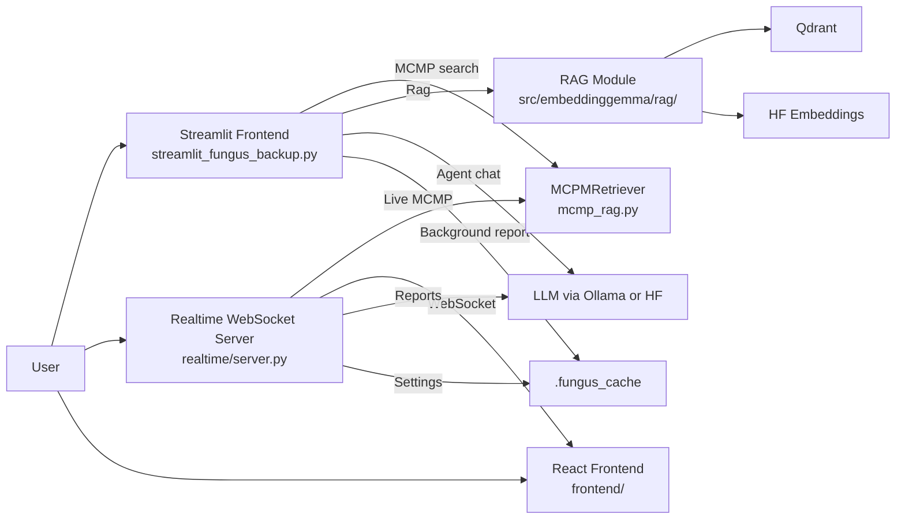
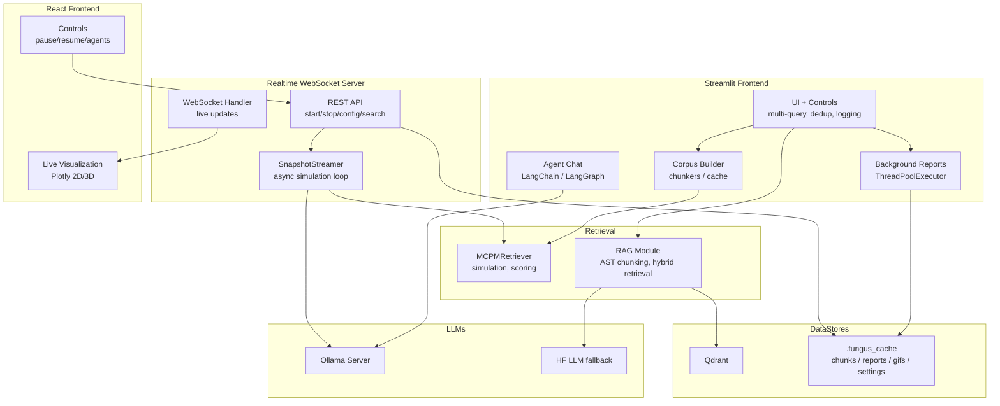
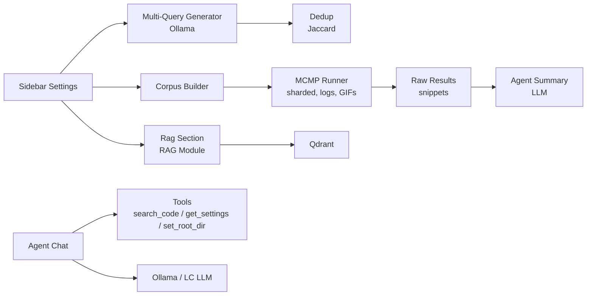
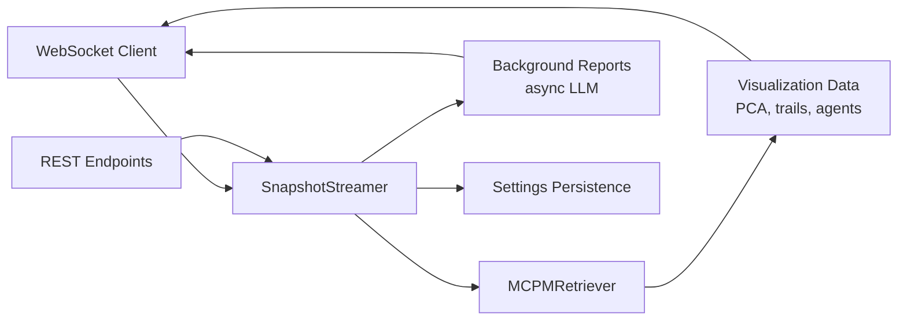

### Architecture (C4 diagrams)

#### C4: System Context (Level 1)

Key points:
- Dual frontend: Streamlit UI (comprehensive) and React/WebSocket (realtime visualization)
- Realtime server provides live simulation updates, pause/resume, agent manipulation
- MCMP runs in-process; background reports use thread pool (Streamlit) or async (realtime server)
- RAG module supports both Qdrant persistence and in-memory operations
- LLMs via Ollama by default; HF LLM fallback where needed

#### C4: Container (Level 2)

#### C4: Component (Level 3) – Frontend internals

**Streamlit Frontend Flow:**

**Realtime Server Components:**

CPU/GPU:
- Simulation and chunking are CPU-heavy; embeddings can use GPU.
- Not recommended to move the MCMP loop to GPU; keep HF embeddings on GPU if available.

Model upgrades:
- UI: set OLLAMA_MODEL; to use external providers, replace the local generator helper with your SDK.
- Agent chat: swap the LC chat model for one with tool-calls support.
- RagV1: set use_ollama=true or change llm_model/llm_device.

MCMP vs RAG:
- MCMP explores with agents and pheromone trails to reveal multi-hop traces (dependencies across files) that static nearest-neighbor search misses.
- RAG module provides traditional semantic + keyword hybrid search with persistent vector stores.

Architecture Evolution:
- **Current**: Dual interface (Streamlit comprehensive, React/WebSocket realtime)
- **Realtime Features**: Live simulation control, agent manipulation, streaming reports
- **Integration**: Both interfaces share core MCMP and RAG components
- **Future**: Enhanced agent orchestration, persistent trail analysis, collaborative editing integration
