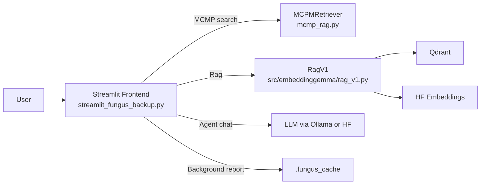
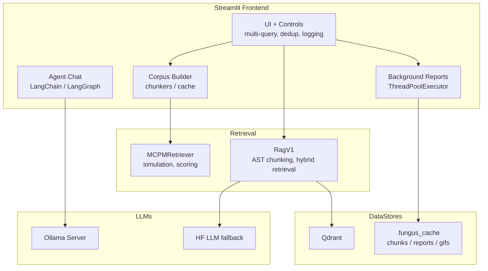
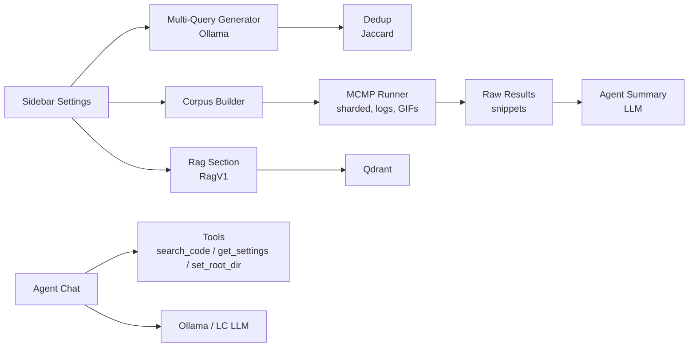

### Architecture (C4 diagrams)

#### C4: System Context (Level 1)

Key points:
- Streamlit UI is primary; includes Rag (RagV1).
- MCMP runs in-process; background reports use a thread pool.
- RagV1 persists vectors to Qdrant; embeddings via EmbeddingGemma.
- LLMs via Ollama by default; HF LLM fallback where needed.

#### C4: Container (Level 2)

#### C4: Component (Level 3) – Frontend internals

CPU/GPU:
- Simulation and chunking are CPU-heavy; embeddings can use GPU.
- Not recommended to move the MCMP loop to GPU; keep HF embeddings on GPU if available.

Model upgrades:
- UI: set OLLAMA_MODEL; to use external providers, replace the local generator helper with your SDK.
- Agent chat: swap the LC chat model for one with tool-calls support.
- RagV1: set use_ollama=true or change llm_model/llm_device.

MCMP vs RAG:
- MCMP explores with agents and pheromone trails to reveal multi-hop traces (dependencies across files) that static nearest-neighbor search misses.

Current → Agent-based:
- Today: MCMP loop and optional agent chat.
- Target: orchestrate retrieval as agent tools (corpus slicing, MCMP passes, Enterprise hints), persist trails, feed a coder agent via the Edit Events API.
