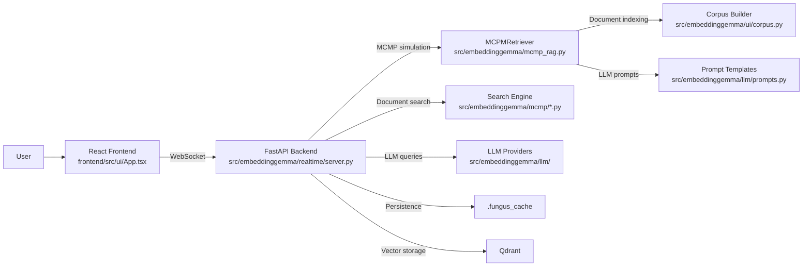
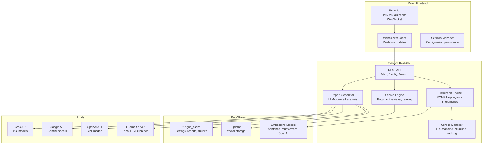
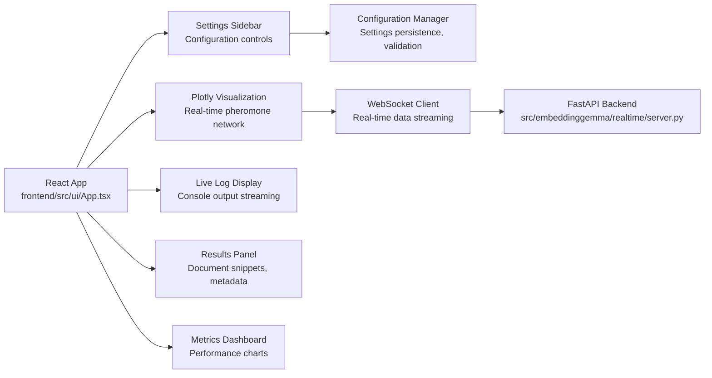
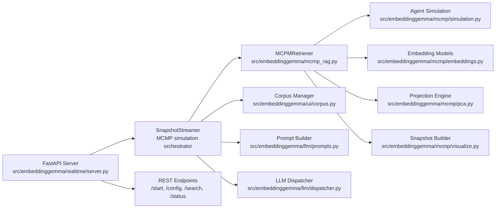

### Architecture (C4 diagrams)

#### C4: System Context (Level 1)

Key points:
- React + TypeScript frontend with Vite build system and WebSocket real-time updates
- FastAPI backend serving the React app and providing WebSocket API
- MCMP (Multi-agent Codebase Pattern Matching) simulation for intelligent code exploration
- Modular LLM integration supporting Ollama, OpenAI, Google, and Grok
- Corpus chunking and indexing with AST-aware parsing for Python files

#### C4: Container (Level 2)

#### C4: Component (Level 3) – Frontend internals

#### C4: Component (Level 3) – Backend internals

Key architectural principles:
- **Real-time WebSocket streaming** for live simulation updates
- **Modular LLM integration** supporting multiple providers (Ollama, OpenAI, Google, Grok)
- **AST-aware chunking** for intelligent code parsing and indexing
- **Multi-agent simulation** with pheromone-based exploration
- **Contextual steering** using LLM-powered relevance assessment

Performance considerations:
- Simulation and chunking are CPU-intensive operations
- Embedding models can leverage GPU acceleration when available
- WebSocket connections enable efficient real-time updates
- Corpus caching reduces redundant processing

Technology stack:
- **Frontend**: React 18, TypeScript, Vite, Plotly.js, Tailwind CSS
- **Backend**: FastAPI, Pydantic, WebSocket support
- **ML/AI**: SentenceTransformers, NumPy, scikit-learn, FAISS
- **External APIs**: Ollama, OpenAI, Google AI, Grok/x.ai
