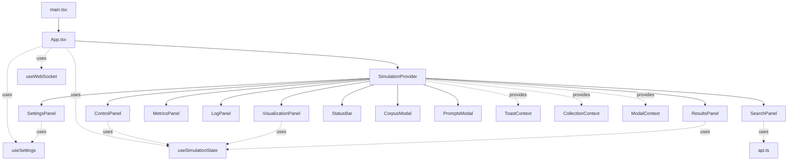

# Frontend Architecture

This document describes the React/TypeScript frontend architecture for the LA Fungus Search system.

## Overview

The frontend is a **React + TypeScript + Vite** application that provides a real-time interface for MCMP simulation exploration. The architecture follows modern React patterns with custom hooks, context providers, and component composition.

**Key Technologies:**
- **React 18** - UI library with concurrent features
- **TypeScript** - Type safety and developer experience
- **Vite** - Fast build tool and dev server
- **Plotly** - 3D visualization and charts
- **WebSocket** - Real-time updates from backend

**Code Statistics:**
- **Total Lines**: ~2,900
- **Components**: 10 modular UI components
- **Hooks**: 3 custom hooks for state management
- **Context**: 1 context provider with 3 sub-contexts
- **Services**: 1 API client module
- **Types**: Comprehensive TypeScript definitions

---

## File Structure

```
frontend/src/
├── ui/
│   └── App.tsx                   # Main app component (230 lines)
├── types/
│   └── index.ts                  # TypeScript type definitions (143 lines)
├── services/
│   └── api.ts                    # API client functions (149 lines)
├── hooks/
│   ├── useWebSocket.ts           # WebSocket connection hook (123 lines)
│   ├── useSimulationState.ts    # Simulation state management (155 lines)
│   └── useSettings.ts            # Settings state management (335 lines)
├── context/
│   └── SimulationContext.tsx     # Global context provider (124 lines)
└── components/
    ├── ControlPanel.tsx          # Simulation controls (156 lines)
    ├── SearchPanel.tsx           # Search interface (47 lines)
    ├── SettingsPanel.tsx         # Settings UI (737 lines)
    ├── MetricsPanel.tsx          # Metrics display (42 lines)
    ├── LogPanel.tsx              # Log viewer (68 lines)
    ├── ResultsPanel.tsx          # Results display (182 lines)
    ├── StatusBar.tsx             # Status bar (48 lines)
    ├── VisualizationPanel.tsx    # 3D visualization (189 lines)
    ├── CorpusModal.tsx           # Corpus modal (42 lines)
    └── PromptsModal.tsx          # Prompts modal (107 lines)
```

---

## Component Hierarchy



---

## Core Concepts

### 1. Custom Hooks Pattern

The application uses custom hooks to encapsulate complex state logic and side effects. This keeps components clean and focuses them on presentation.

**Benefits:**
- Reusable state logic
- Easier testing
- Cleaner component code
- Better separation of concerns

### 2. Context API for Global State

Global state is managed via React Context API, split into logical domains:
- **ToastContext**: Toast notifications
- **CollectionContext**: Qdrant collection state
- **ModalContext**: Modal visibility and state

**Benefits:**
- Avoids prop drilling
- Clean component interfaces
- Type-safe state access
- Centralized state management

### 3. Component Composition

Components are small, focused, and composable. Each component has a single responsibility and communicates via props or context.

**Benefits:**
- Easy to understand
- Easy to test
- Easy to maintain
- Promotes reuse

### 4. TypeScript for Type Safety

All code is written in TypeScript with comprehensive type definitions. Types are shared across the application for consistency.

**Benefits:**
- Compile-time error detection
- Better IDE support
- Self-documenting code
- Refactoring safety

---

## Custom Hooks

### useWebSocket

**File:** `frontend/src/hooks/useWebSocket.ts` (123 lines)

**Purpose:** Manages WebSocket connection to backend for real-time updates.

**API:**
```typescript
interface UseWebSocketProps {
  onSnapshot: (snap: Snapshot) => void
  onReport: (report: Report) => void
  onResults: (results: SearchResult[]) => void
  onSeedQueries: (added: string[], poolSize: number) => void
  onLog: (message: string) => void
  onMetrics: (metrics: any) => void
  onJobProgress: (jobId: string, percent: number) => void
}

interface UseWebSocketReturn {
  sendConfig: (config: any) => void
}

function useWebSocket(props: UseWebSocketProps): UseWebSocketReturn
```

**Features:**
- Auto-connect on mount
- Auto-reconnect with exponential backoff
- Message parsing and routing
- Config updates via WebSocket
- Error handling and logging

**Usage:**
```typescript
const { sendConfig } = useWebSocket({
  onSnapshot: (snap) => setSnapshot(snap),
  onReport: (report) => addReport(report),
  onMetrics: (metrics) => updateMetrics(metrics),
  // ... other callbacks
})

// Send config update
sendConfig({ redraw_every: 3 })
```

---

### useSimulationState

**File:** `frontend/src/hooks/useSimulationState.ts` (155 lines)

**Purpose:** Manages all simulation-related state (snapshots, reports, results, metrics).

**API:**
```typescript
interface SimulationState {
  // State
  snap: Snapshot | null
  reports: Report[]
  results: SearchResult[]
  seedQueries: string[]
  logs: string[]
  metrics: {
    avg_rel: number
    max_rel: number
    trails: number
    avg_speed: number
  }
  jobId: string
  jobPct: number

  // Setters
  setSnap: (snap: Snapshot) => void
  addReport: (report: Report) => void
  addResults: (results: SearchResult[]) => void
  addSeedQueries: (queries: string[], poolSize: number) => void
  addLog: (message: string) => void
  updateMetrics: (metrics: any) => void
  setJobId: (id: string) => void
  setJobPct: (percent: number) => void

  // Actions
  clearReports: () => void
  clearResults: () => void
  clearLogs: () => void
}

function useSimulationState(): SimulationState
```

**Features:**
- Snapshot management (latest only)
- Report accumulation with limit (100 max)
- Results accumulation
- Metrics tracking
- Log buffering (1000 max)
- Job progress tracking

**Usage:**
```typescript
const simulation = useSimulationState()

// Update state
simulation.setSnap(newSnapshot)
simulation.addReport(newReport)
simulation.updateMetrics({ avg_rel: 0.8 })

// Access state
const { snap, reports, metrics } = simulation
```

---

### useSettings

**File:** `frontend/src/hooks/useSettings.ts` (335 lines)

**Purpose:** Manages all application settings with persistence.

**API:**
```typescript
interface Settings {
  // Visualization
  viz_dims: number
  redraw_every: number
  min_trail_strength: number
  max_edges: number

  // Corpus
  use_repo: boolean
  root_folder: string
  max_files: number
  exclude_dirs: string[]
  windows: number[]
  chunk_workers: number

  // Simulation
  query: string
  max_iterations: number
  num_agents: number
  exploration_bonus: number
  pheromone_decay: number
  embed_batch_size: number
  max_chunks_per_shard: number

  // LLM & Reporting
  report_enabled: boolean
  report_every: number
  report_mode: string
  judge_enabled: boolean
  judge_mode: string

  // Blended scoring
  alpha: number
  beta: number
  gamma: number
  delta: number
  epsilon: number
  min_content_chars: number
  import_only_penalty: number

  // LLM Provider configs
  llm_provider: string
  ollama_model: string
  ollama_host: string
  // ... (many more LLM settings)
}

interface UseSettingsReturn {
  settings: Settings
  updateSetting: (key: string, value: any) => void
  applySettings: () => Promise<void>
  loadSettings: () => Promise<void>
}

function useSettings(): UseSettingsReturn
```

**Features:**
- Loads settings from backend on mount
- Local state management
- Bulk update via `applySettings()`
- Individual setting updates
- Type-safe setting access
- Validation via backend

**Usage:**
```typescript
const { settings, updateSetting, applySettings } = useSettings()

// Update single setting
updateSetting('num_agents', 300)

// Apply all changes to backend
await applySettings()
```

---

## Context Providers

### SimulationContext

**File:** `frontend/src/context/SimulationContext.tsx` (124 lines)

**Purpose:** Provides global state via three sub-contexts.

**Contexts:**

**1. ToastContext**
```typescript
interface ToastContextValue {
  toasts: string[]
  addToast: (message: string) => void
}
```

**2. CollectionContext**
```typescript
interface CollectionContextValue {
  collections: Collection[]
  setCollections: (collections: Collection[]) => void
  activeCollection: string
  setActiveCollection: (name: string) => void
}
```

**3. ModalContext**
```typescript
interface ModalContextValue {
  showCorpus: boolean
  setShowCorpus: (show: boolean) => void
  showPrompts: boolean
  setShowPrompts: (show: boolean) => void
  corpusFiles: string[]
  setCorpusFiles: (files: string[]) => void
  corpusPage: number
  setCorpusPage: (page: number) => void
  corpusTotal: number
  setCorpusTotal: (total: number) => void
  promptModes: string[]
  setPromptModes: (modes: string[]) => void
  promptDefaults: Record<string, string>
  setPromptDefaults: (defaults: Record<string, string>) => void
  promptOverrides: Record<string, string>
  setPromptOverrides: (overrides: Record<string, string>) => void
  promptModeSel: string
  setPromptModeSel: (mode: string) => void
  autoScrollReport: boolean
  setAutoScrollReport: (enabled: boolean) => void
}
```

**Usage:**
```typescript
import { useToasts, useCollections, useModals } from '../context/SimulationContext'

function MyComponent() {
  const { addToast } = useToasts()
  const { collections } = useCollections()
  const { showCorpus, setShowCorpus } = useModals()

  // Use context values
}
```

---

## Components

### App.tsx (Main Component)

**File:** `frontend/src/ui/App.tsx` (230 lines)

**Purpose:** Main application component that orchestrates all other components.

**Responsibilities:**
- Initialize hooks (WebSocket, settings, simulation state)
- Wire up WebSocket callbacks
- Load collections on mount
- Handle keyboard shortcuts (Escape to close modals)
- Render all UI components

**Structure:**
```typescript
function AppContent() {
  // Context hooks
  const { toasts, addToast } = useToasts()
  const { setCollections, setActiveCollection } = useCollections()
  const modals = useModals()

  // State hooks
  const settings = useSettings()
  const simulation = useSimulationState()

  // WebSocket hook
  const { sendConfig } = useWebSocket({
    onSnapshot: simulation.setSnap,
    onReport: simulation.addReport,
    // ... other callbacks
  })

  // Effects and event handlers
  useEffect(() => { /* load collections */ }, [])
  useEffect(() => { /* keyboard shortcuts */ }, [])

  // Render
  return (
    <>
      <SettingsPanel {...props} />
      <ControlPanel {...props} />
      <SearchPanel {...props} />
      <VisualizationPanel {...props} />
      {/* ... other components */}
    </>
  )
}

function App() {
  return (
    <SimulationProvider>
      <AppContent />
    </SimulationProvider>
  )
}
```

---

### SettingsPanel

**File:** `frontend/src/components/SettingsPanel.tsx` (737 lines)

**Purpose:** Comprehensive settings UI with collapsible sections.

**Features:**
- Organized into sections (Visualization, Corpus, Simulation, LLM, etc.)
- Collapsible sections for better UX
- Real-time validation
- LLM provider switching
- Theme controls
- Apply/Reset buttons

**Sections:**
1. Visualization (viz_dims, redraw_every, trails, edges)
2. Corpus (root_folder, max_files, exclude_dirs, windows)
3. Simulation (max_iterations, num_agents, bonuses, decay)
4. LLM & Reporting (report_enabled, modes, budgets)
5. Contextual Steering (alpha, beta, gamma, delta, epsilon)
6. LLM Provider (provider selection, API keys, models)

---

### ControlPanel

**File:** `frontend/src/components/ControlPanel.tsx` (156 lines)

**Purpose:** Simulation control buttons and status.

**Features:**
- Start/Stop/Reset/Pause/Resume buttons
- Agent count controls (add, resize)
- Corpus status display
- Action buttons (Corpus, Prompts, Collections)
- Disabled state management

**Actions:**
- `handleStart()` - Start simulation with current settings
- `handleStop()` - Stop simulation
- `handleReset()` - Reset simulation state
- `handlePause()` - Pause simulation
- `handleResume()` - Resume simulation
- `handleAddAgents()` - Add more agents
- `handleResizeAgents()` - Set agent count

---

### SearchPanel

**File:** `frontend/src/components/SearchPanel.tsx` (47 lines)

**Purpose:** Simple search interface.

**Features:**
- Query input field
- Top-K slider
- Search and Answer buttons
- Loading states

**Actions:**
- `handleSearch()` - POST /search with query
- `handleAnswer()` - POST /answer with query

---

### VisualizationPanel

**File:** `frontend/src/components/VisualizationPanel.tsx` (189 lines)

**Purpose:** 3D/2D visualization of simulation using Plotly.

**Features:**
- 3D scatter plot for documents and agents
- Pheromone trail edges
- Color-coded by relevance
- Hover tooltips with file info
- Camera controls
- Dark/light theme support

**Data:**
- **Documents**: Red-yellow gradient by relevance
- **Agents**: Blue points
- **Trails**: Gray lines with varying opacity

**Plotly Configuration:**
```typescript
{
  data: [
    {
      type: 'scatter3d',
      mode: 'markers',
      x: docX, y: docY, z: docZ,
      marker: {
        size: 4,
        color: relevance,
        colorscale: 'YlOrRd'
      }
    },
    {
      type: 'scatter3d',
      mode: 'markers',
      x: agentX, y: agentY, z: agentZ,
      marker: { size: 2, color: 'blue' }
    },
    // ... trail edges
  ],
  layout: {
    scene: { camera: {...}, bgcolor: '...' },
    paper_bgcolor: '...',
    margin: {...}
  }
}
```

---

### MetricsPanel

**File:** `frontend/src/components/MetricsPanel.tsx` (42 lines)

**Purpose:** Display current simulation metrics.

**Metrics:**
- `avg_rel` - Average relevance across all documents
- `max_rel` - Maximum relevance score
- `trails` - Number of active pheromone trails
- `avg_speed` - Average agent speed

**Display:**
```
Avg Rel: 0.65 | Max Rel: 0.92 | Trails: 847 | Avg Speed: 0.023
```

---

### LogPanel

**File:** `frontend/src/components/LogPanel.tsx` (68 lines)

**Purpose:** Display log messages from simulation.

**Features:**
- Auto-scroll to bottom
- Max 1000 messages
- Monospace font
- Dark background
- Clear button

---

### ResultsPanel

**File:** `frontend/src/components/ResultsPanel.tsx` (182 lines)

**Purpose:** Display search results and reports.

**Tabs:**
1. **Results** - Search results with relevance scores
2. **Reports** - LLM-generated reports
3. **Seed Queries** - Follow-up queries

**Features:**
- Syntax highlighting for code
- Collapsible results
- File path display
- Relevance score badges
- Auto-scroll option for reports

---

### StatusBar

**File:** `frontend/src/components/StatusBar.tsx` (48 lines)

**Purpose:** Bottom status bar with system info.

**Display:**
- Current collection
- Connection status
- Job progress (if running)
- Toast notifications

---

### CorpusModal

**File:** `frontend/src/components/CorpusModal.tsx` (42 lines)

**Purpose:** Modal dialog for viewing corpus files.

**Features:**
- Paginated file list
- Next/Previous buttons
- File count display
- Close on Escape

---

### PromptsModal

**File:** `frontend/src/components/PromptsModal.tsx` (107 lines)

**Purpose:** Modal dialog for editing prompt templates.

**Features:**
- Mode selector (deep, structure, exploratory, etc.)
- Default prompt display
- Override editor (textarea)
- Save button
- Reset to default

---

## API Client

### services/api.ts

**File:** `frontend/src/services/api.ts` (149 lines)

**Purpose:** Centralized API client with typed functions.

**Functions:**

```typescript
// Simulation control
export async function startSimulation(settings: any): Promise<any>
export async function stopSimulation(): Promise<any>
export async function resetSimulation(): Promise<any>
export async function pauseSimulation(): Promise<any>
export async function resumeSimulation(): Promise<any>

// Search
export async function search(query: string, topK: number): Promise<any>
export async function answer(query: string, topK: number): Promise<any>

// Settings
export async function fetchSettings(): Promise<any>
export async function saveSettings(settings: any): Promise<any>

// Collections
export async function fetchCollections(): Promise<any>
export async function switchCollection(name: string): Promise<any>

// Corpus
export async function fetchCorpusFiles(page: number, perPage: number): Promise<any>
export async function fetchCorpusSummary(): Promise<any>

// Prompts
export async function fetchPrompts(): Promise<any>
export async function savePrompt(mode: string, template: string): Promise<any>

// Agents
export async function addAgents(count: number): Promise<any>
export async function resizeAgents(count: number): Promise<any>
```

**Error Handling:**
All functions throw errors on non-200 status codes. Components should use try-catch:

```typescript
try {
  const result = await api.startSimulation(settings)
  addToast('Simulation started')
} catch (error) {
  addToast('Error: ' + error.message)
}
```

---

## Type Definitions

### types/index.ts

**File:** `frontend/src/types/index.ts` (143 lines)

**Key Types:**

```typescript
export type ThemeMode = 'light' | 'dark' | 'system'

export interface Snapshot {
  documents: {
    xy: number[][]
    relevance: number[]
    meta?: any[]
  }
  agents: {
    xy: number[][]
  }
  edges: Array<{
    source: number
    target: number
    strength: number
  }>
}

export interface Collection {
  name: string
  point_count: number
  dimension: number
  is_active: boolean
}

export interface SearchResult {
  relevance_score?: number
  metadata?: {
    file_path?: string
    line_range?: number[]
  }
  content?: string
}

export interface Report {
  step: number
  data: {
    summary?: string
    items?: ReportItem[]
  }
}

export interface ReportItem {
  embedding_score?: number
  file_path?: string
  line_range?: number[]
  code_purpose?: string
  relevance_to_query?: string
}
```

---

## Data Flow

### User Action → Backend → UI Update

```
1. User clicks "Start" button
   ↓
2. ControlPanel.handleStart()
   ↓
3. api.startSimulation(settings)
   ↓
4. POST /start to backend
   ↓
5. Backend starts simulation
   ↓
6. Backend sends WebSocket messages
   ↓
7. useWebSocket receives message
   ↓
8. Calls callback (e.g., onSnapshot)
   ↓
9. useSimulationState.setSnap(snapshot)
   ↓
10. React state update
   ↓
11. VisualizationPanel re-renders
```

### Settings Update Flow

```
1. User changes setting in SettingsPanel
   ↓
2. useSettings.updateSetting(key, value)
   ↓
3. Local state updated
   ↓
4. User clicks "Apply"
   ↓
5. useSettings.applySettings()
   ↓
6. api.saveSettings(settings)
   ↓
7. POST /settings to backend
   ↓
8. Backend validates and persists
   ↓
9. Response returned
   ↓
10. Toast notification shown
```

---

## Styling

**CSS Approach:**
- Global styles in `App.css`
- Component-specific styles inline
- CSS variables for theming
- Responsive design with flexbox/grid

**Theme Variables:**
```css
:root {
  --bg-primary: #ffffff;
  --bg-secondary: #f5f5f5;
  --text-primary: #000000;
  --text-secondary: #666666;
  --border: #dddddd;
  --accent: #007bff;
}

.dark {
  --bg-primary: #1a1a1a;
  --bg-secondary: #2a2a2a;
  --text-primary: #ffffff;
  --text-secondary: #aaaaaa;
  --border: #444444;
  --accent: #4a90e2;
}
```

---

## Performance Considerations

**Optimization Techniques:**

1. **Memoization**
   - Use `useMemo` for expensive computations
   - Use `useCallback` for event handlers

2. **Lazy Loading**
   - Code splitting with React.lazy()
   - Dynamic imports for large dependencies

3. **WebSocket Throttling**
   - Backend throttles updates via `redraw_every`
   - Frontend buffers rapid updates

4. **Virtual Scrolling**
   - Consider for large result lists
   - Currently not implemented

5. **State Updates**
   - Batch state updates when possible
   - Avoid unnecessary re-renders

---

## Testing Strategy

**Unit Tests:**
- Test custom hooks in isolation
- Test utility functions
- Mock API calls

**Integration Tests:**
- Test component interactions
- Test WebSocket flow
- Test error handling

**E2E Tests:**
- Test full user workflows
- Test with real backend
- Use Playwright (currently configured)

---

## Future Improvements

1. **State Management**
   - Consider Redux or Zustand for complex state
   - Add state persistence (localStorage)

2. **Performance**
   - Add virtual scrolling for results
   - Implement windowing for large logs
   - Optimize Plotly rendering

3. **UX**
   - Add keyboard shortcuts guide
   - Add loading skeletons
   - Improve error messages
   - Add undo/redo for settings

4. **Features**
   - Add export functionality (CSV, JSON)
   - Add search history
   - Add bookmark/favorite results
   - Add diff view for file changes

5. **Testing**
   - Increase test coverage
   - Add visual regression tests
   - Add performance benchmarks

---

## Development Workflow

**Start Dev Server:**
```bash
cd frontend
npm run dev
```

**Build for Production:**
```bash
npm run build
```

**Run Tests:**
```bash
npm test
npm run test:e2e
```

**Lint:**
```bash
npm run lint
```

---

## See Also

- **Architecture**: `docs/ARCHITECTURE.md`
- **API Reference**: `docs/API_REFERENCE.md`
- **Maintenance**: `docs/MAINTENANCE.md`
- **Configuration**: `docs/CONFIG_REFERENCE.md`
