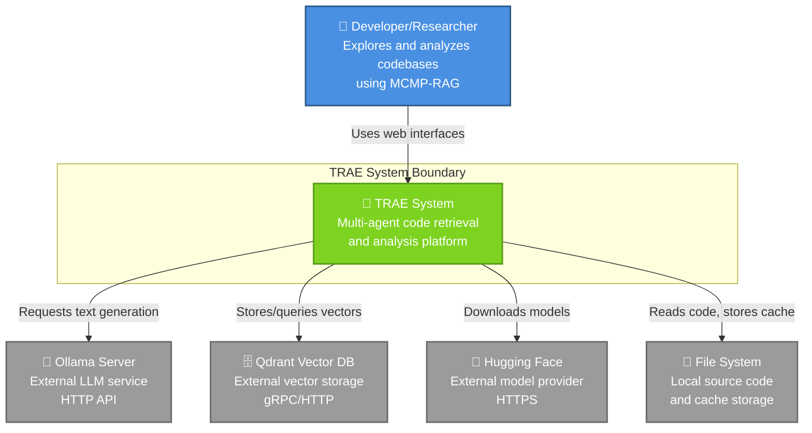
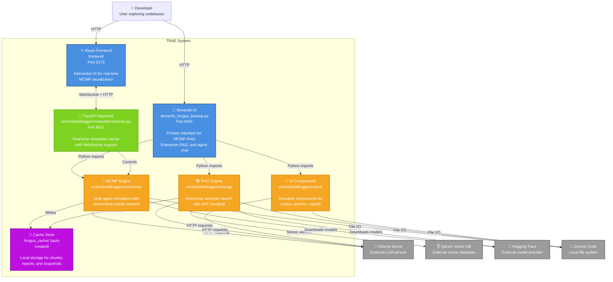
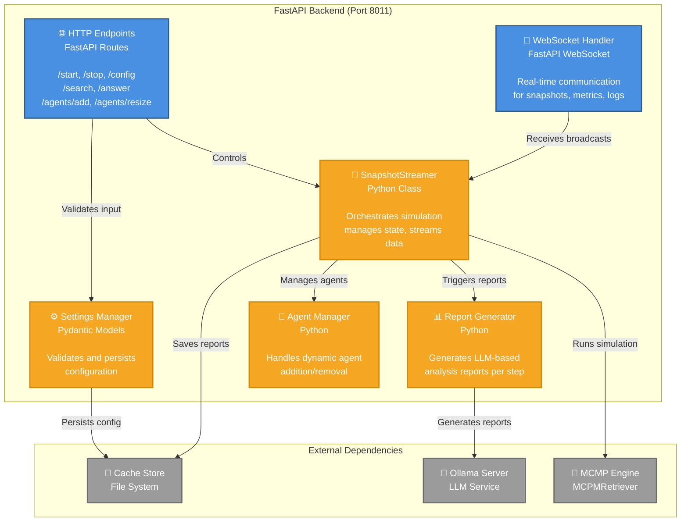
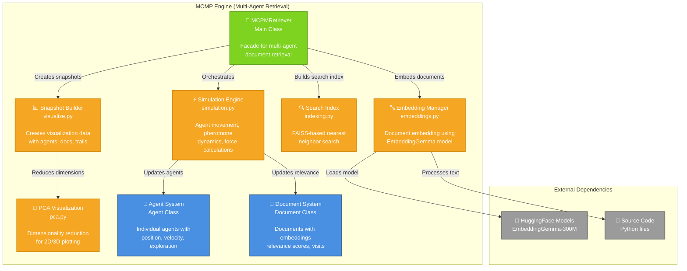
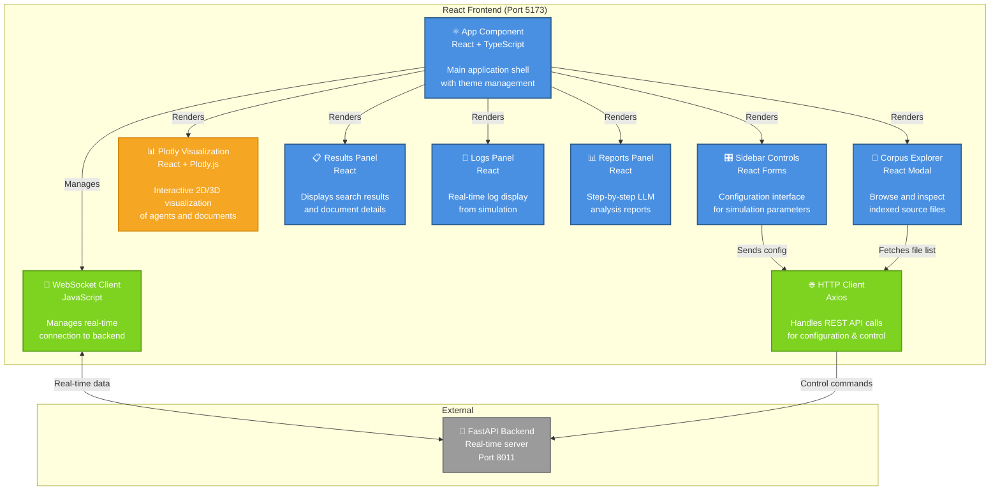
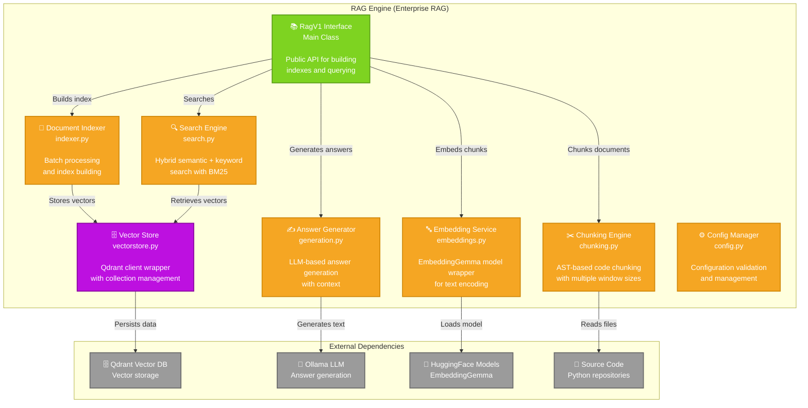
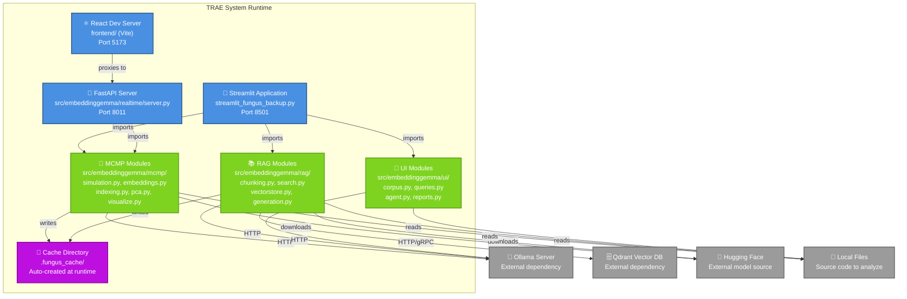
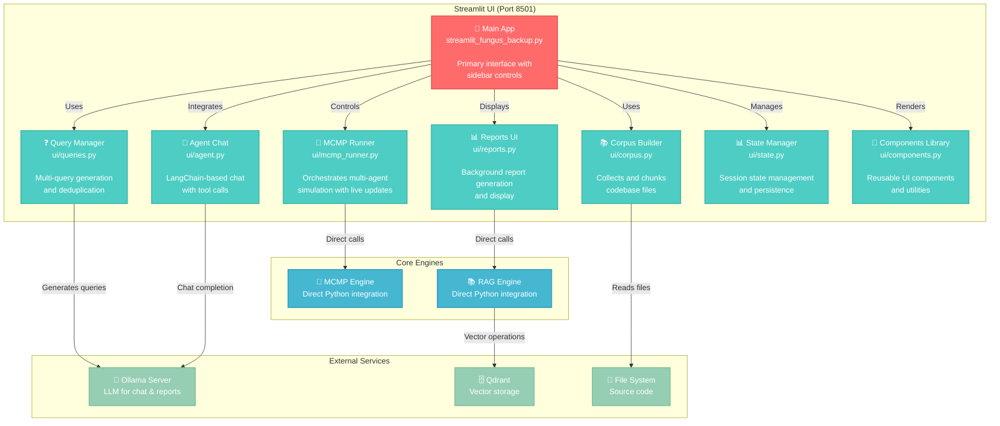
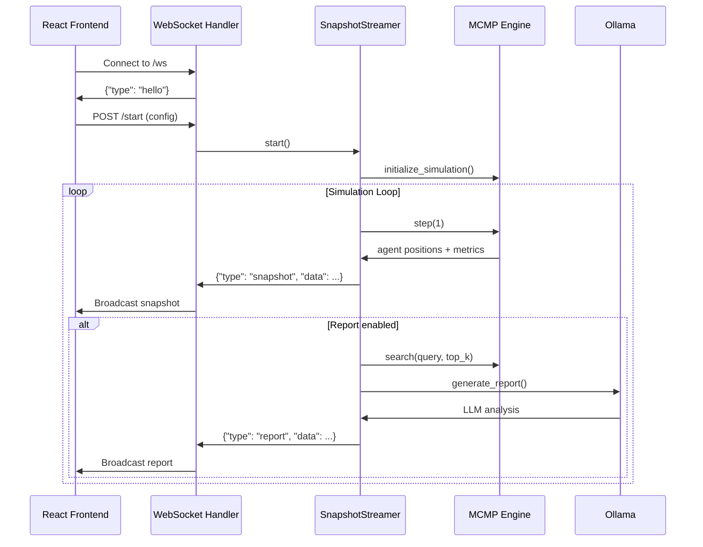
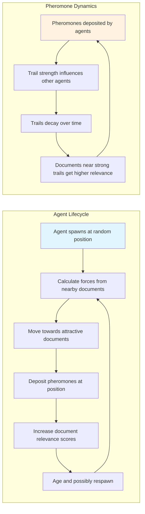

# TRAE System Architecture - C4 Diagrams

This document provides comprehensive C4 diagrams for the TRAE (EmbeddingGemma) system architecture, showing the system from multiple levels of abstraction.

## C4 Level 1: System Context Diagram



## C4 Level 2: Container Diagram



## C4 Level 3: Component Diagram - FastAPI Backend



## C4 Level 3: Component Diagram - MCMP Engine



## C4 Level 3: Component Diagram - React Frontend



## C4 Level 3: Component Diagram - RAG Engine



## Data Flow Diagram - MCMP Simulation Process


## Runtime Deployment Diagram



## C4 Level 3: Component Diagram - Streamlit UI



## Integration Patterns

### WebSocket Communication Pattern



### MCMP Agent Behavior Pattern



## Notes

- **Ports**: The system uses multiple ports (5173 for React dev, 8011 for FastAPI, 8501 for Streamlit)
- **Real-time**: WebSocket communication enables live visualization of the multi-agent simulation
- **Hybrid Architecture**: Supports both direct Streamlit UI and separate React+FastAPI architecture
- **External Dependencies**: Requires Ollama for LLM capabilities and optionally Qdrant for persistent vector storage
- **Caching Strategy**: Heavy use of local file caching for performance (.fungus_cache directory)
- **Model Integration**: Deep integration with HuggingFace ecosystem, particularly EmbeddingGemma model

## Current System Architecture Summary

### Core Application Components (What Exists)

| Component | File Location | Port | Type | Purpose |
|-----------|---------------|------|------|---------|
| **Streamlit UI** | streamlit_fungus_backup.py | 8501 | Python app | Primary research interface |
| **React Frontend** | frontend/ | 5173 | TypeScript app | Real-time visualization |
| **FastAPI Backend** | src/embeddinggemma/realtime/server.py | 8011 | Python API | WebSocket simulation server |
| **MCMP Engine** | src/embeddinggemma/mcmp/ | - | Python modules | Multi-agent retrieval |
| **RAG Engine** | src/embeddinggemma/rag/ | - | Python modules | Semantic search |
| **UI Components** | src/embeddinggemma/ui/ | - | Python modules | Shared UI logic |

### Python Module Structure (Current State)

| Module | Files | Purpose |
|--------|-------|---------|
| **mcmp/** | simulation.py, embeddings.py, indexing.py, pca.py, visualize.py | Multi-agent simulation |
| **rag/** | chunking.py, search.py, vectorstore.py, generation.py, config.py | Enterprise RAG |
| **ui/** | corpus.py, queries.py, agent.py, reports.py, state.py, components.py | UI components |
| **agents/** | agent_fungus_rag.py | Agent chat functionality |
| **realtime/** | server.py | FastAPI WebSocket server |

### Configuration Files (What Exists)

| File | Purpose | Content |
|------|---------|---------|
| **pyproject.toml** | Python project config | Dependencies, metadata |
| **requirements.txt** | Python dependencies | 22 packages with versions |
| **package.json** | Node.js dependencies | React, Vite, Plotly, TypeScript |
| **vite.config.ts** | Vite configuration | Dev server, proxy rules |
| **.python-version** | Python version | 3.12 |
| **CONTRIBUTING.md** | Development guide | Setup, linting, testing |

### Current Codebase File Structure

```
EmbeddingGemma/
├── streamlit_fungus_backup.py          # Primary Streamlit interface
├── run-streamlit.ps1                   # Streamlit launcher script
├── run-realtime.ps1                    # FastAPI launcher script
├── frontend/                           # React application
│   ├── src/ui/App.tsx                  # Main React component
│   ├── package.json                    # Node.js dependencies
│   └── vite.config.ts                  # Vite dev server config
├── src/embeddinggemma/
│   ├── mcmp/                           # Multi-agent simulation
│   │   ├── simulation.py               # Agent dynamics
│   │   ├── embeddings.py               # EmbeddingGemma integration
│   │   ├── indexing.py                 # FAISS search
│   │   ├── pca.py                      # Dimensionality reduction
│   │   └── visualize.py                # Snapshot generation
│   ├── rag/                            # Enterprise RAG
│   │   ├── chunking.py                 # AST-based chunking
│   │   ├── search.py                   # Hybrid search
│   │   ├── vectorstore.py              # Qdrant integration
│   │   ├── generation.py               # Answer generation
│   │   └── config.py                   # RAG configuration
│   ├── ui/                             # UI component modules
│   │   ├── corpus.py                   # Corpus management
│   │   ├── queries.py                  # Multi-query logic
│   │   ├── agent.py                    # Agent chat
│   │   ├── reports.py                  # Report generation
│   │   └── components.py               # UI utilities
│   ├── agents/
│   │   └── agent_fungus_rag.py         # Agent chat implementation
│   ├── realtime/
│   │   └── server.py                   # FastAPI WebSocket server
│   └── mcmp_rag.py                     # Legacy MCMP facade
├── tests/                              # Test suites
├── docs/                               # Documentation
├── pyproject.toml                      # Python project configuration
├── requirements.txt                    # Python dependencies
└── .python-version                     # Python version (3.12)
```

## Validation Checklist

✅ **Mermaid Syntax Validation**
- All diagrams use standard Mermaid graph syntax
- No C4-specific extensions that might not render universally
- Proper subgraph definitions with quotes
- Valid node and edge syntax

✅ **Renderability Features**
- Standard flowchart/graph syntax for maximum compatibility
- Emoji icons for visual clarity
- Color-coded node classifications
- Clear relationship labels
- Proper escaping of special characters

✅ **Content Accuracy**
- Diagrams reflect actual codebase structure
- Port numbers match implementation
- Technology stack correctly represented
- Component relationships validated against source code

## Rendering Instructions

These C4 diagrams use standard Mermaid syntax and should be renderable in:

### ✅ Guaranteed Support
- **GitHub/GitLab Markdown** - Native Mermaid support
- **Mermaid Live Editor** - https://mermaid.live/
- **Visual Studio Code** - With Mermaid Preview extension
- **JetBrains IDEs** - With Mermaid plugin

### ✅ Documentation Platforms
- **GitBook** - Native Mermaid support
- **Notion** - Copy/paste from Mermaid Live
- **Confluence** - With Mermaid macro
- **DocuSaurus** - With @docusaurus/theme-mermaid

### 🔧 Validation Steps
1. Copy any diagram to https://mermaid.live/ for instant validation
2. Check syntax highlighting in your IDE
3. Verify all arrows and relationships render correctly
4. Test color themes (light/dark mode compatibility)

For best results, ensure your documentation platform has updated Mermaid support (version 9.0+).

## Current System Ports (As Configured)

| Service | Port | Protocol | Configuration Source |
|---------|------|----------|---------------------|
| React Dev Server | 5173 | HTTP/WS | vite.config.ts |
| Streamlit UI | 8501 | HTTP | run-streamlit.ps1 |
| FastAPI Backend | 8011 | HTTP/WS | run-realtime.ps1 |

## Current System Integration Points

### External Service Dependencies (Expected by Code)

| Service | Usage in Code | Configuration |
|---------|---------------|---------------|
| **Ollama** | generate_with_ollama() calls | OLLAMA_MODEL, OLLAMA_HOST env vars |
| **Qdrant** | qdrant-client in rag/vectorstore.py | QDRANT_URL, QDRANT_API_KEY env vars |
| **HuggingFace** | sentence-transformers model loading | Automatic download to models/ |

### Current Test Configuration

From `.github/workflows/ci.yml`:
- Python versions: 3.10, 3.11, 3.12
- Test command: `pytest -q --maxfail=1 --disable-warnings`
- Dependencies: requirements.txt + requirements-dev.txt

This represents the current state of the TRAE system as it exists in the codebase.