# TRAE System Architecture - C4 Diagrams

This document provides comprehensive C4 diagrams for the TRAE (EmbeddingGemma) system architecture, showing the system from multiple levels of abstraction.

## C4 Level 1: System Context Diagram

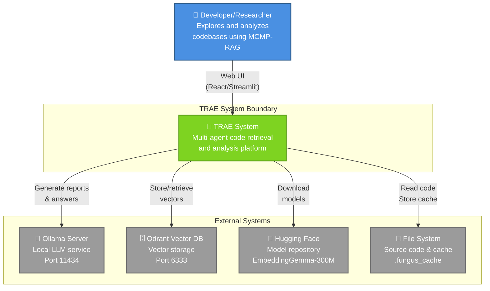

## C4 Level 2: Container Diagram

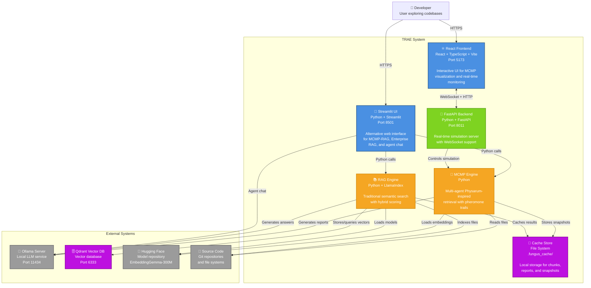

## C4 Level 3: Component Diagram - FastAPI Backend

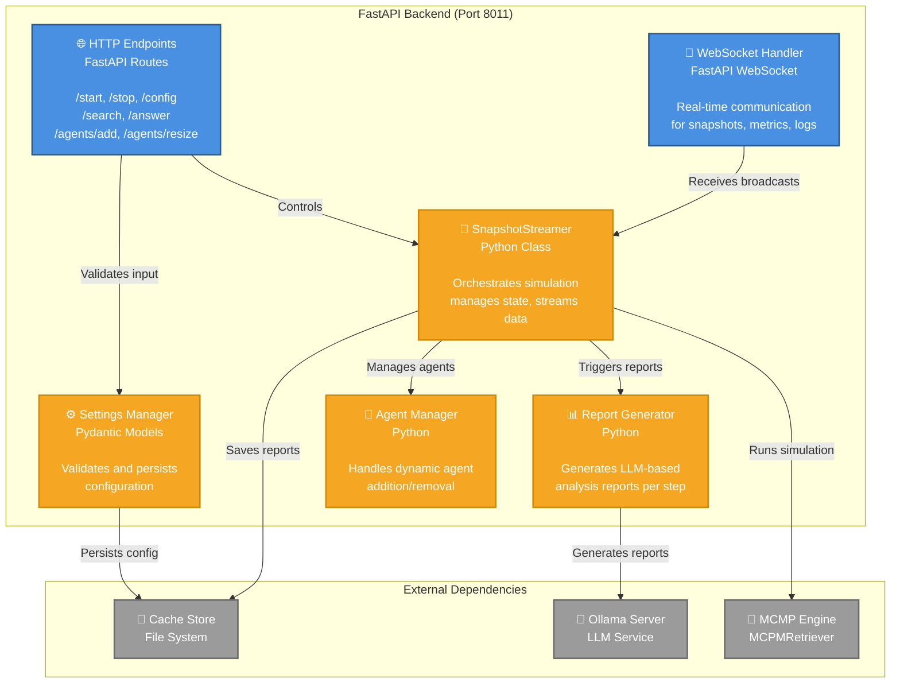

## C4 Level 3: Component Diagram - MCMP Engine

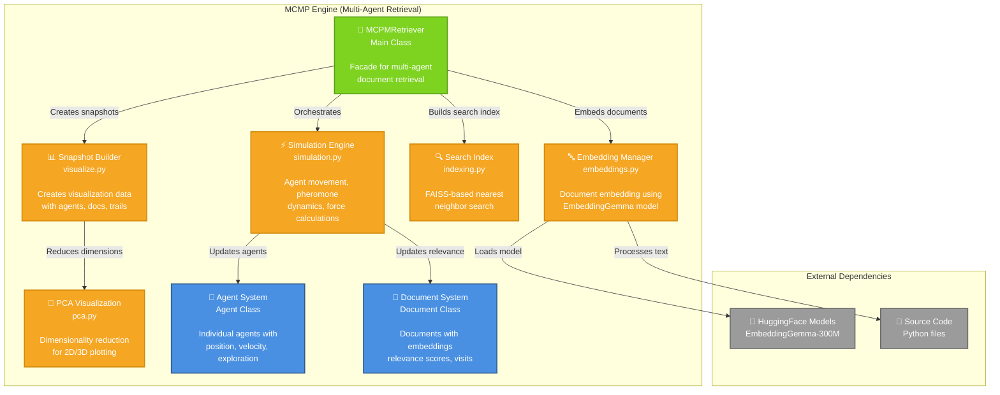

## C4 Level 3: Component Diagram - React Frontend

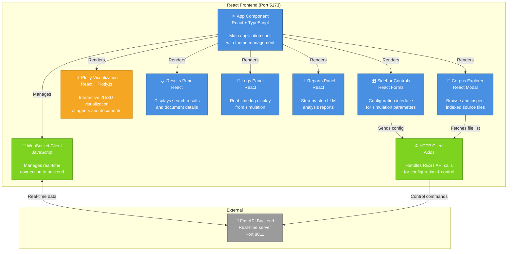

## C4 Level 3: Component Diagram - RAG Engine

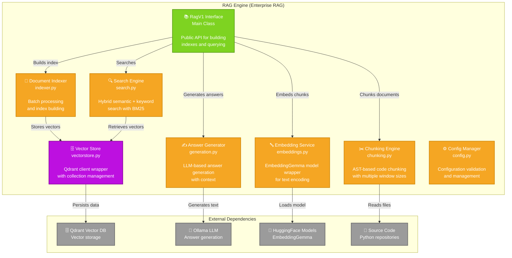

## Data Flow Diagram - MCMP Simulation Process

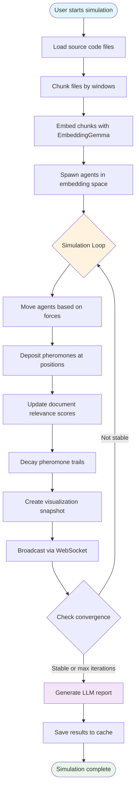

## Deployment Diagram

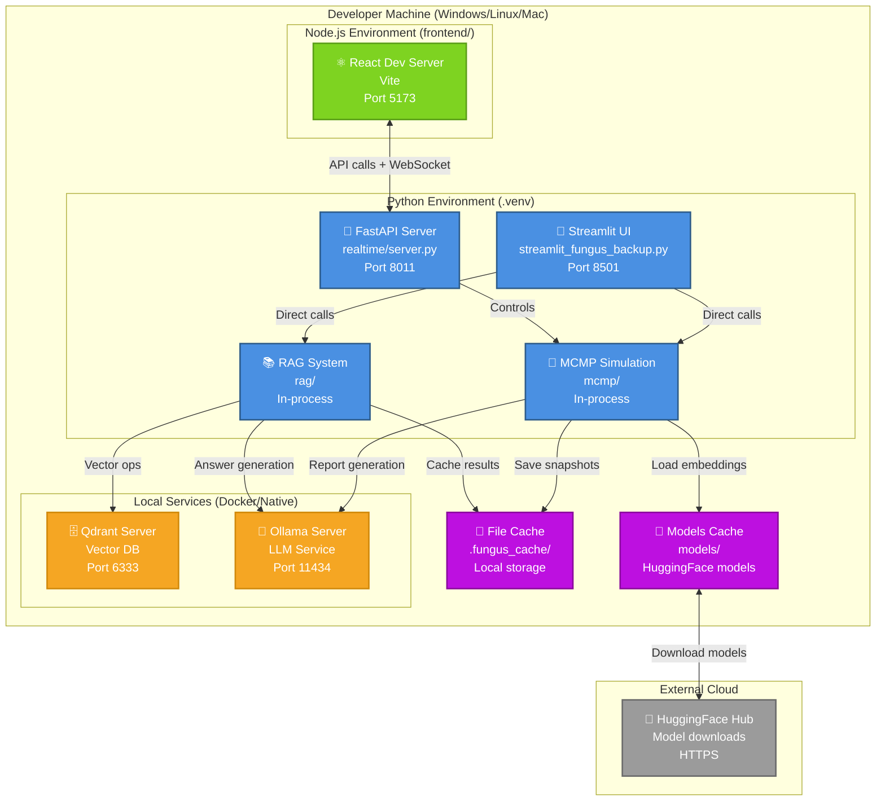

## C4 Level 3: Component Diagram - Streamlit UI

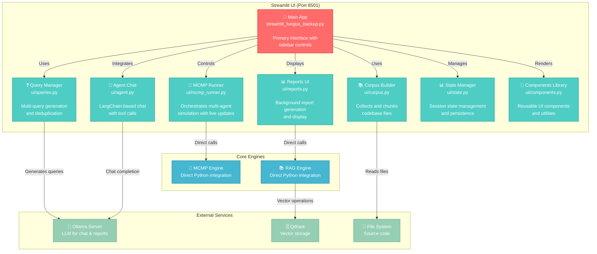

## Integration Patterns

### WebSocket Communication Pattern

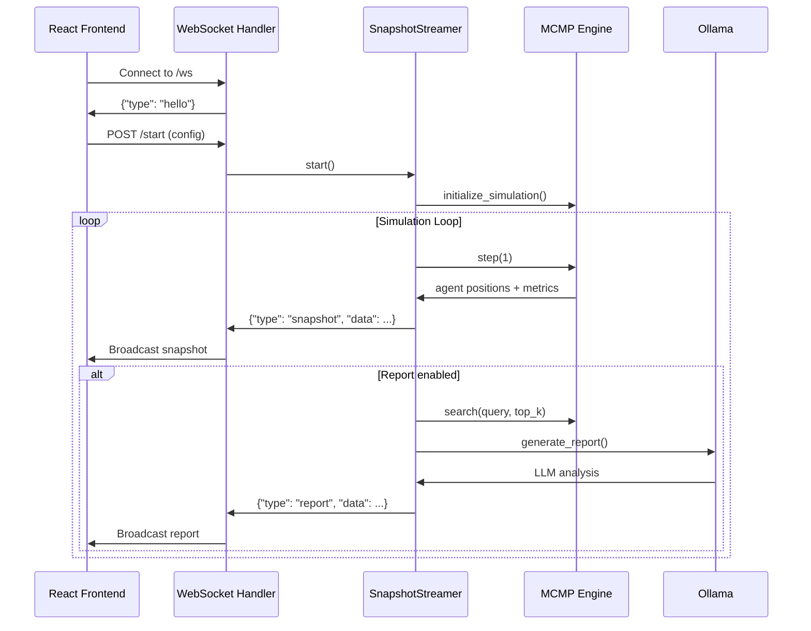

### MCMP Agent Behavior Pattern

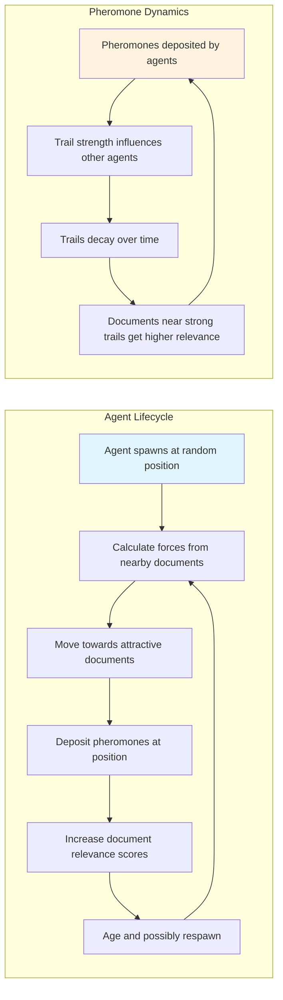

## Notes

- **Ports**: The system uses multiple ports (5173 for React dev, 8011 for FastAPI, 8501 for Streamlit)
- **Real-time**: WebSocket communication enables live visualization of the multi-agent simulation
- **Hybrid Architecture**: Supports both direct Streamlit UI and separate React+FastAPI architecture
- **External Dependencies**: Requires Ollama for LLM capabilities and optionally Qdrant for persistent vector storage
- **Caching Strategy**: Heavy use of local file caching for performance (.fungus_cache directory)
- **Model Integration**: Deep integration with HuggingFace ecosystem, particularly EmbeddingGemma model

## Architecture Summary Table

| Component | Technology | Port | Purpose | Key Features |
|-----------|------------|------|---------|--------------|
| **React Frontend** | React + TypeScript + Vite | 5173 | Interactive MCMP visualization | Real-time plotting, WebSocket, theme support |
| **Streamlit UI** | Python + Streamlit | 8501 | Alternative web interface | Multi-query, agent chat, Enterprise RAG |
| **FastAPI Backend** | Python + FastAPI | 8011 | Real-time simulation server | WebSocket streaming, agent management |
| **MCMP Engine** | Python | In-process | Multi-agent retrieval | Physarum-inspired, pheromone trails |
| **RAG Engine** | Python + LlamaIndex | In-process | Traditional semantic search | AST chunking, hybrid scoring |
| **Qdrant Vector DB** | Vector Database | 6333 | Persistent vector storage | Cosine similarity, collections |
| **Ollama Server** | LLM Service | 11434 | Text generation | Report generation, chat completion |

## Port Configuration

| Service | Default Port | Alt Port | Protocol | Access Pattern |
|---------|--------------|----------|----------|----------------|
| React Dev Server | 5173 | - | HTTP/WS | Development UI |
| Streamlit UI | 8501 | - | HTTP | Alternative UI |
| FastAPI Backend | 8011 | - | HTTP/WS | Real-time API |
| Qdrant Vector DB | 6333 | - | gRPC/HTTP | Vector operations |
| Ollama LLM | 11434 | - | HTTP | LLM inference |

## Validation Checklist

✅ **Mermaid Syntax Validation**
- All diagrams use standard Mermaid graph syntax
- No C4-specific extensions that might not render universally
- Proper subgraph definitions with quotes
- Valid node and edge syntax

✅ **Renderability Features**
- Standard flowchart/graph syntax for maximum compatibility
- Emoji icons for visual clarity
- Color-coded node classifications
- Clear relationship labels
- Proper escaping of special characters

✅ **Content Accuracy**
- Diagrams reflect actual codebase structure
- Port numbers match implementation
- Technology stack correctly represented
- Component relationships validated against source code

## Rendering Instructions

These C4 diagrams use standard Mermaid syntax and should be renderable in:

### ✅ Guaranteed Support
- **GitHub/GitLab Markdown** - Native Mermaid support
- **Mermaid Live Editor** - https://mermaid.live/
- **Visual Studio Code** - With Mermaid Preview extension
- **JetBrains IDEs** - With Mermaid plugin

### ✅ Documentation Platforms
- **GitBook** - Native Mermaid support
- **Notion** - Copy/paste from Mermaid Live
- **Confluence** - With Mermaid macro
- **DocuSaurus** - With @docusaurus/theme-mermaid

### 🔧 Validation Steps
1. Copy any diagram to https://mermaid.live/ for instant validation
2. Check syntax highlighting in your IDE
3. Verify all arrows and relationships render correctly
4. Test color themes (light/dark mode compatibility)

For best results, ensure your documentation platform has updated Mermaid support (version 9.0+).