# TRAE System Architecture - C4 Diagrams

This document provides comprehensive C4 diagrams for the TRAE (EmbeddingGemma) system architecture, showing the system from multiple levels of abstraction.

## C4 Level 1: System Context Diagram

```mermaid
graph TB
    subgraph "Development Environment"
        Python["🐍 Python 3.10+<br/>Virtual Environment<br/>.venv/"]
        NodeJS["⚛️ Node.js Environment<br/>npm packages<br/>frontend/node_modules/"]
        Scripts["🔧 PowerShell Scripts<br/>run-streamlit.ps1<br/>run-realtime.ps1"]
    end
    
    subgraph "External Dependencies & Services"
        Ollama["🤖 Ollama Server<br/>Local LLM service<br/>Port 11434<br/>ENV: OLLAMA_MODEL, OLLAMA_HOST"]
        Qdrant["🗄️ Qdrant Vector DB<br/>Vector storage<br/>Port 6333<br/>ENV: QDRANT_URL, QDRANT_API_KEY"]
        HF["🤗 Hugging Face Hub<br/>Model downloads<br/>EmbeddingGemma-300M<br/>Transformers, sentence-transformers"]
        GPU["🚀 GPU Support<br/>CUDA/MPS (optional)<br/>PyTorch with GPU"]
    end
    
    subgraph "TRAE System Core"
        TRAE["🧠 TRAE System<br/>Multi-agent code retrieval<br/>and analysis platform<br/><br/>• MCMP-RAG simulation<br/>• Enterprise RAG<br/>• Agent chat & tools"]
    end
    
    subgraph "File System & Storage"
        FS["📁 Source Code<br/>Git repositories<br/>Python codebases"]
        Cache["💾 Local Cache<br/>.fungus_cache/<br/>chunks, reports, gifs"]
        Models["🏗️ Model Cache<br/>models/<br/>HuggingFace models"]
        Config["⚙️ Configuration<br/>pyproject.toml<br/>requirements.txt<br/>vite.config.ts"]
    end
    
    User["👤 Developer/Researcher<br/>Code exploration & analysis<br/>using MCMP and RAG methods"]
    
    User -->|"Web Interfaces"| TRAE
    User -->|"Setup & Configuration"| Scripts
    
    TRAE -->|"LLM Inference"| Ollama
    TRAE -->|"Vector Operations"| Qdrant
    TRAE -->|"Model Loading"| HF
    TRAE -->|"GPU Acceleration"| GPU
    
    TRAE -->|"Read Source Code"| FS
    TRAE -->|"Cache Results"| Cache
    TRAE -->|"Load Models"| Models
    
    Scripts -->|"Environment Setup"| Python
    Scripts -->|"Dependency Install"| NodeJS
    Scripts -->|"Load Config"| Config
    
    Config -->|"Python Dependencies"| Python
    Config -->|"Frontend Dependencies"| NodeJS
    
    classDef user fill:#4A90E2,stroke:#2E5C8A,stroke-width:2px,color:white
    classDef system fill:#7ED321,stroke:#5A9E18,stroke-width:2px,color:white
    classDef external fill:#9B9B9B,stroke:#6B6B6B,stroke-width:2px,color:white
    classDef storage fill:#BD10E0,stroke:#8B0A9E,stroke-width:2px,color:white
    classDef dev fill:#F5A623,stroke:#D1890B,stroke-width:2px,color:white
    
    class User user
    class TRAE system
    class Ollama,Qdrant,HF,GPU external
    class FS,Cache,Models,Config storage
    class Python,NodeJS,Scripts dev
```



## C4 Level 2: Container Diagram

```mermaid
graph TB
    User["👤 Developer<br/>User exploring codebases"]
    
    subgraph "TRAE System"
        ReactFE["⚛️ React Frontend<br/>React + TypeScript + Vite<br/>Port 5173<br/><br/>Interactive UI for MCMP<br/>visualization and real-time<br/>monitoring"]
        
        StreamlitUI["🌊 Streamlit UI<br/>Python + Streamlit<br/>Port 8501<br/><br/>Alternative web interface<br/>for MCMP-RAG, Enterprise<br/>RAG, and agent chat"]
        
        FastAPI["🚀 FastAPI Backend<br/>Python + FastAPI<br/>Port 8011<br/><br/>Real-time simulation server<br/>with WebSocket support"]
        
        MCMP["🧠 MCMP Engine<br/>Python<br/><br/>Multi-agent Physarum-inspired<br/>retrieval with pheromone trails"]
        
        RAG["📚 RAG Engine<br/>Python + LlamaIndex<br/><br/>Traditional semantic search<br/>with hybrid scoring"]
        
        Cache["💾 Cache Store<br/>File System<br/>.fungus_cache/<br/><br/>Local storage for chunks,<br/>reports, and snapshots"]
    end
    
    subgraph "External Systems"
        Ollama["🤖 Ollama Server<br/>Local LLM service<br/>Port 11434"]
        QdrantDB["🗄️ Qdrant Vector DB<br/>Vector database<br/>Port 6333"]
        HFModels["🤗 Hugging Face<br/>Model repository<br/>EmbeddingGemma-300M"]
        SourceCode["📁 Source Code<br/>Git repositories<br/>and file systems"]
    end
    
    User -->|HTTPS| ReactFE
    User -->|HTTPS| StreamlitUI
    
    ReactFE <-->|WebSocket + HTTP| FastAPI
    StreamlitUI -->|Python calls| MCMP
    StreamlitUI -->|Python calls| RAG
    
    FastAPI -->|Controls simulation| MCMP
    MCMP -->|Stores snapshots| Cache
    RAG -->|Stores/queries vectors| QdrantDB
    RAG -->|Caches results| Cache
    
    MCMP -->|Generates reports| Ollama
    RAG -->|Generates answers| Ollama
    StreamlitUI -->|Agent chat| Ollama
    
    MCMP -->|Loads embeddings| HFModels
    RAG -->|Loads models| HFModels
    
    MCMP -->|Reads files| SourceCode
    RAG -->|Indexes files| SourceCode
    
    classDef frontend fill:#4A90E2,stroke:#2E5C8A,stroke-width:2px,color:white
    classDef backend fill:#7ED321,stroke:#5A9E18,stroke-width:2px,color:white
    classDef engine fill:#F5A623,stroke:#D1890B,stroke-width:2px,color:white
    classDef storage fill:#BD10E0,stroke:#8B0A9E,stroke-width:2px,color:white
    classDef external fill:#9B9B9B,stroke:#6B6B6B,stroke-width:2px,color:white
    
    class ReactFE,StreamlitUI frontend
    class FastAPI backend
    class MCMP,RAG engine
    class Cache,QdrantDB storage
    class Ollama,HFModels,SourceCode external
```



## C4 Level 3: Component Diagram - FastAPI Backend

```mermaid
graph TB
    subgraph "FastAPI Backend (Port 8011)"
        HTTPEndpoints["🌐 HTTP Endpoints<br/>FastAPI Routes<br/><br/>/start, /stop, /config<br/>/search, /answer<br/>/agents/add, /agents/resize"]
        
        WSHandler["🔌 WebSocket Handler<br/>FastAPI WebSocket<br/><br/>Real-time communication<br/>for snapshots, metrics, logs"]
        
        SnapshotStreamer["📡 SnapshotStreamer<br/>Python Class<br/><br/>Orchestrates simulation<br/>manages state, streams data"]
        
        SettingsManager["⚙️ Settings Manager<br/>Pydantic Models<br/><br/>Validates and persists<br/>configuration"]
        
        ReportGenerator["📊 Report Generator<br/>Python<br/><br/>Generates LLM-based<br/>analysis reports per step"]
        
        AgentManager["🤖 Agent Manager<br/>Python<br/><br/>Handles dynamic agent<br/>addition/removal"]
    end
    
    subgraph "External Dependencies"
        MCMPEngine["🧠 MCMP Engine<br/>MCPMRetriever"]
        CacheStore["💾 Cache Store<br/>File System"]
        Ollama["🤖 Ollama Server<br/>LLM Service"]
    end
    
    HTTPEndpoints -->|Controls| SnapshotStreamer
    HTTPEndpoints -->|Validates input| SettingsManager
    WSHandler -->|Receives broadcasts| SnapshotStreamer
    
    SnapshotStreamer -->|Runs simulation| MCMPEngine
    SnapshotStreamer -->|Triggers reports| ReportGenerator
    SnapshotStreamer -->|Manages agents| AgentManager
    
    ReportGenerator -->|Generates reports| Ollama
    SettingsManager -->|Persists config| CacheStore
    SnapshotStreamer -->|Saves reports| CacheStore
    
    classDef api fill:#4A90E2,stroke:#2E5C8A,stroke-width:2px,color:white
    classDef core fill:#F5A623,stroke:#D1890B,stroke-width:2px,color:white
    classDef external fill:#9B9B9B,stroke:#6B6B6B,stroke-width:2px,color:white
    
    class HTTPEndpoints,WSHandler api
    class SnapshotStreamer,ReportGenerator,AgentManager,SettingsManager core
    class MCMPEngine,CacheStore,Ollama external
```



## C4 Level 3: Component Diagram - MCMP Engine

```mermaid
graph TB
    subgraph "MCMP Engine (Multi-Agent Retrieval)"
        Retriever["🎯 MCPMRetriever<br/>Main Class<br/><br/>Facade for multi-agent<br/>document retrieval"]
        
        Simulation["⚡ Simulation Engine<br/>simulation.py<br/><br/>Agent movement, pheromone<br/>dynamics, force calculations"]
        
        Embeddings["🔤 Embedding Manager<br/>embeddings.py<br/><br/>Document embedding using<br/>EmbeddingGemma model"]
        
        Indexing["🔍 Search Index<br/>indexing.py<br/><br/>FAISS-based nearest<br/>neighbor search"]
        
        PCAViz["📐 PCA Visualization<br/>pca.py<br/><br/>Dimensionality reduction<br/>for 2D/3D plotting"]
        
        Visualizer["📊 Snapshot Builder<br/>visualize.py<br/><br/>Creates visualization data<br/>with agents, docs, trails"]
        
        AgentSystem["🤖 Agent System<br/>Agent Class<br/><br/>Individual agents with<br/>position, velocity, exploration"]
        
        DocumentSystem["📄 Document System<br/>Document Class<br/><br/>Documents with embeddings<br/>relevance scores, visits"]
    end
    
    subgraph "External Dependencies"
        HFModels["🤗 HuggingFace Models<br/>EmbeddingGemma-300M"]
        SourceFiles["📁 Source Code<br/>Python files"]
    end
    
    Retriever -->|Orchestrates| Simulation
    Retriever -->|Embeds documents| Embeddings
    Retriever -->|Builds search index| Indexing
    Retriever -->|Creates snapshots| Visualizer
    
    Simulation -->|Updates agents| AgentSystem
    Simulation -->|Updates relevance| DocumentSystem
    Visualizer -->|Reduces dimensions| PCAViz
    
    Embeddings -->|Loads model| HFModels
    Embeddings -->|Processes text| SourceFiles
    
    classDef core fill:#7ED321,stroke:#5A9E18,stroke-width:2px,color:white
    classDef processing fill:#F5A623,stroke:#D1890B,stroke-width:2px,color:white
    classDef data fill:#4A90E2,stroke:#2E5C8A,stroke-width:2px,color:white
    classDef external fill:#9B9B9B,stroke:#6B6B6B,stroke-width:2px,color:white
    
    class Retriever core
    class Simulation,Embeddings,Indexing,Visualizer,PCAViz processing
    class AgentSystem,DocumentSystem data
    class HFModels,SourceFiles external
```



## C4 Level 3: Component Diagram - React Frontend


## C4 Level 3: Component Diagram - RAG Engine

```mermaid
graph TB
    subgraph "RAG Engine (Enterprise RAG)"
        RagInterface["📚 RagV1 Interface<br/>Main Class<br/><br/>Public API for building<br/>indexes and querying"]
        
        ChunkingEngine["✂️ Chunking Engine<br/>chunking.py<br/><br/>AST-based code chunking<br/>with multiple window sizes"]
        
        EmbeddingService["🔤 Embedding Service<br/>embeddings.py<br/><br/>EmbeddingGemma model wrapper<br/>for text encoding"]
        
        VectorStore["🗄️ Vector Store<br/>vectorstore.py<br/><br/>Qdrant client wrapper<br/>with collection management"]
        
        SearchEngine["🔍 Search Engine<br/>search.py<br/><br/>Hybrid semantic + keyword<br/>search with BM25"]
        
        Indexer["📇 Document Indexer<br/>indexer.py<br/><br/>Batch processing<br/>and index building"]
        
        Generator["✍️ Answer Generator<br/>generation.py<br/><br/>LLM-based answer generation<br/>with context"]
        
        ConfigManager["⚙️ Config Manager<br/>config.py<br/><br/>Configuration validation<br/>and management"]
    end
    
    subgraph "External Dependencies"
        QdrantDB["🗄️ Qdrant Vector DB<br/>Vector storage"]
        OllamaLLM["🤖 Ollama LLM<br/>Answer generation"]
        HFModels["🤗 HuggingFace Models<br/>EmbeddingGemma"]
        SourceFiles["📁 Source Code<br/>Python repositories"]
    end
    
    RagInterface -->|Chunks documents| ChunkingEngine
    RagInterface -->|Embeds chunks| EmbeddingService
    RagInterface -->|Builds index| Indexer
    RagInterface -->|Searches| SearchEngine
    RagInterface -->|Generates answers| Generator
    
    Indexer -->|Stores vectors| VectorStore
    SearchEngine -->|Retrieves vectors| VectorStore
    VectorStore -->|Persists data| QdrantDB
    
    Generator -->|Generates text| OllamaLLM
    EmbeddingService -->|Loads model| HFModels
    ChunkingEngine -->|Reads files| SourceFiles
    
    classDef interface fill:#7ED321,stroke:#5A9E18,stroke-width:2px,color:white
    classDef processing fill:#F5A623,stroke:#D1890B,stroke-width:2px,color:white
    classDef storage fill:#BD10E0,stroke:#8B0A9E,stroke-width:2px,color:white
    classDef external fill:#9B9B9B,stroke:#6B6B6B,stroke-width:2px,color:white
    
    class RagInterface interface
    class ChunkingEngine,EmbeddingService,SearchEngine,Indexer,Generator,ConfigManager processing
    class VectorStore storage
    class QdrantDB,OllamaLLM,HFModels,SourceFiles external
```



## Data Flow Diagram - MCMP Simulation Process


## Complete Setup & Deployment Diagram

```mermaid
graph TB
    subgraph "Developer Machine (Windows/Linux/Mac)"
        subgraph "Setup Phase"
            SetupScripts["🔧 Setup Scripts<br/>run-streamlit.ps1<br/>run-realtime.ps1"]
            ConfigFiles["📄 Configuration Files<br/>pyproject.toml<br/>requirements.txt<br/>package.json<br/>vite.config.ts"]
            EnvVars["🌍 Environment Variables<br/>OLLAMA_MODEL=qwen2.5-coder:7b<br/>OLLAMA_HOST=http://127.0.0.1:11434<br/>QDRANT_URL=http://localhost:6333<br/>RAG_COLLECTION=codebase<br/>EMBED_MODEL=google/embeddinggemma-300m"]
        end
        
        subgraph "Python Environment (.venv) - Requirements"
            PythonCore["🐍 Python Core Dependencies<br/>torch>=2.0.0<br/>numpy>=1.21.0<br/>scikit-learn>=1.0.0<br/>pandas>=1.3.0<br/>requests>=2.28.0"]
            
            EmbeddingStack["🔤 Embedding Stack<br/>sentence-transformers>=3.0.0<br/>transformers>=4.35.0<br/>faiss-cpu>=1.7.0<br/>sentencepiece>=0.1.99"]
            
            WebFrameworks["🌐 Web Frameworks<br/>streamlit>=1.28.0<br/>fastapi + uvicorn<br/>websockets + wsproto"]
            
            MLLibs["🧠 ML/AI Libraries<br/>ollama>=0.1.0<br/>qdrant-client>=1.7.0<br/>llama-index>=0.9.0<br/>rank-bm25>=0.2.2"]
            
            VisualizationLibs["📊 Visualization<br/>plotly>=5.0.0<br/>matplotlib>=3.5.0<br/>networkx>=3.0"]
            
            UtilityLibs["🛠️ Utilities<br/>gitpython>=3.1.40<br/>python-simhash>=0.0.1<br/>scikit-learn-extra>=0.3.0"]
        end
        
        subgraph "Node.js Environment (frontend/)"
            ReactStack["⚛️ React Stack<br/>react@18.3.1<br/>react-dom@18.3.1<br/>@types/react@18.3.3"]
            
            BuildTools["🔨 Build Tools<br/>vite@5.4.3<br/>@vitejs/plugin-react@4.3.1<br/>typescript@5.6.2"]
            
            PlotlyStack["📊 Plotting<br/>plotly.js-dist-min@2.35.2<br/>react-plotly.js@2.6.0"]
            
            HTTPClient["🌐 HTTP Client<br/>axios@1.7.7"]
            
            TestingTools["🧪 Testing<br/>@playwright/test@1.48.2"]
        end
        
        subgraph "Runtime Services"
            StreamlitApp["🌊 Streamlit UI<br/>streamlit_fungus_backup.py<br/>Port 8501<br/>Primary research interface"]
            
            FastAPIServer["🚀 FastAPI Server<br/>realtime/server.py<br/>Port 8011<br/>WebSocket + REST API"]
            
            ReactDev["⚛️ React Dev Server<br/>Vite dev server<br/>Port 5173<br/>Real-time visualization"]
        end
        
        subgraph "Core Engines (In-Process)"
            MCMPEngine["🧠 MCMP Engine<br/>src/embeddinggemma/mcmp/<br/>Multi-agent simulation<br/>Pheromone-based retrieval"]
            
            RAGEngine["📚 RAG Engine<br/>src/embeddinggemma/rag/<br/>Enterprise semantic search<br/>AST chunking + hybrid scoring"]
            
            UIComponents["🎨 UI Components<br/>src/embeddinggemma/ui/<br/>Corpus builder, queries<br/>Agent chat, reports"]
        end
        
        subgraph "Local Storage"
            FileCache["💾 Cache (.fungus_cache/)<br/>• Simulation snapshots<br/>• Report JSONs<br/>• Generated GIFs<br/>• Settings persistence"]
            
            ModelsCache["🏗️ Models Cache (models/)<br/>• EmbeddingGemma-300M<br/>• Tokenizer files<br/>• FAISS indices"]
            
            SourceCode["📁 Source Code<br/>• Git repositories<br/>• Python codebases<br/>• AST-parsed chunks"]
        end
        
        subgraph "External Services (Local/Remote)"
            QdrantService["🗄️ Qdrant Vector DB<br/>Port 6333<br/>• Vector collections<br/>• Similarity search<br/>• Persistent storage"]
            
            OllamaService["🤖 Ollama Server<br/>Port 11434<br/>• Local LLM inference<br/>• Report generation<br/>• Chat completion"]
        end
    end
    
    subgraph "External Cloud Services"
        HFHub["🤗 HuggingFace Hub<br/>• Model downloads<br/>• EmbeddingGemma-300M<br/>• Tokenizers<br/>• License validation"]
        
        GitRepos["📦 Git Repositories<br/>• Source code repos<br/>• Version control<br/>• Clone/pull operations"]
    end
    
    subgraph "Hardware Resources"
        CPU["💻 CPU<br/>• MCMP simulation<br/>• Python processing<br/>• Multi-threading"]
        
        GPU["🚀 GPU (Optional)<br/>• PyTorch acceleration<br/>• CUDA/MPS support<br/>• Embedding inference"]
        
        Memory["🧠 RAM<br/>• Document embeddings<br/>• Agent positions<br/>• Model weights"]
        
        Storage["💿 Disk Storage<br/>• Model cache<br/>• Vector indices<br/>• Simulation data"]
    end
    
    %% Setup Dependencies
    SetupScripts -->|Initialize| PythonCore
    SetupScripts -->|Install| ReactStack
    ConfigFiles -->|Define| PythonCore
    ConfigFiles -->|Configure| BuildTools
    EnvVars -->|Configure| OllamaService
    EnvVars -->|Configure| QdrantService
    
    %% Runtime Dependencies
    StreamlitApp -->|Uses| UIComponents
    StreamlitApp -->|Runs| MCMPEngine
    StreamlitApp -->|Runs| RAGEngine
    FastAPIServer -->|Controls| MCMPEngine
    ReactDev -->|Proxies to| FastAPIServer
    
    %% Core Engine Dependencies
    MCMPEngine -->|Loads| EmbeddingStack
    MCMPEngine -->|Uses| VisualizationLibs
    RAGEngine -->|Uses| MLLibs
    RAGEngine -->|Connects| QdrantService
    UIComponents -->|Calls| OllamaService
    
    %% Storage Dependencies
    MCMPEngine -->|Saves| FileCache
    RAGEngine -->|Caches| ModelsCache
    MCMPEngine -->|Reads| SourceCode
    RAGEngine -->|Indexes| SourceCode
    
    %% External Dependencies
    ModelsCache <-->|Downloads| HFHub
    SourceCode <-->|Clones| GitRepos
    OllamaService -->|Inference| CPU
    EmbeddingStack -->|Acceleration| GPU
    MCMPEngine -->|Uses| Memory
    FileCache -->|Persists| Storage
    
    classDef setup fill:#FF6B6B,stroke:#E55555,stroke-width:2px,color:white
    classDef python fill:#4A90E2,stroke:#2E5C8A,stroke-width:2px,color:white
    classDef nodejs fill:#7ED321,stroke:#5A9E18,stroke-width:2px,color:white
    classDef runtime fill:#F5A623,stroke:#D1890B,stroke-width:2px,color:white
    classDef storage fill:#BD10E0,stroke:#8B0A9E,stroke-width:2px,color:white
    classDef external fill:#9B9B9B,stroke:#6B6B6B,stroke-width:2px,color:white
    classDef hardware fill:#50E3C2,stroke:#2DB398,stroke-width:2px,color:white
    
    class SetupScripts,ConfigFiles,EnvVars setup
    class PythonCore,EmbeddingStack,WebFrameworks,MLLibs,VisualizationLibs,UtilityLibs python
    class ReactStack,BuildTools,PlotlyStack,HTTPClient,TestingTools nodejs
    class StreamlitApp,FastAPIServer,ReactDev,MCMPEngine,RAGEngine,UIComponents runtime
    class FileCache,ModelsCache,SourceCode,QdrantService storage
    class OllamaService,HFHub,GitRepos external
    class CPU,GPU,Memory,Storage hardware
```



## C4 Level 3: Component Diagram - Streamlit UI

```mermaid
graph TB
    subgraph "Streamlit UI (Port 8501)"
        MainApp["🌊 Main App<br/>streamlit_fungus_backup.py<br/><br/>Primary interface with<br/>sidebar controls"]
        
        MCMPRunner["🏃 MCMP Runner<br/>ui/mcmp_runner.py<br/><br/>Orchestrates multi-agent<br/>simulation with live updates"]
        
        CorpusBuilder["📚 Corpus Builder<br/>ui/corpus.py<br/><br/>Collects and chunks<br/>codebase files"]
        
        QueryManager["❓ Query Manager<br/>ui/queries.py<br/><br/>Multi-query generation<br/>and deduplication"]
        
        AgentChat["💬 Agent Chat<br/>ui/agent.py<br/><br/>LangChain-based chat<br/>with tool calls"]
        
        ReportsUI["📊 Reports UI<br/>ui/reports.py<br/><br/>Background report generation<br/>and display"]
        
        StateManager["📊 State Manager<br/>ui/state.py<br/><br/>Session state management<br/>and persistence"]
        
        ComponentsLib["🧩 Components Library<br/>ui/components.py<br/><br/>Reusable UI components<br/>and utilities"]
    end
    
    subgraph "Core Engines"
        MCMPEngine["🧠 MCMP Engine<br/>Direct Python integration"]
        RAGEngine["📚 RAG Engine<br/>Direct Python integration"]
    end
    
    subgraph "External Services"
        OllamaLLM["🤖 Ollama Server<br/>LLM for chat & reports"]
        QdrantDB["🗄️ Qdrant<br/>Vector storage"]
        FileSystem["📁 File System<br/>Source code"]
    end
    
    MainApp -->|Controls| MCMPRunner
    MainApp -->|Uses| CorpusBuilder
    MainApp -->|Uses| QueryManager
    MainApp -->|Integrates| AgentChat
    MainApp -->|Displays| ReportsUI
    MainApp -->|Manages| StateManager
    MainApp -->|Renders| ComponentsLib
    
    MCMPRunner -->|Direct calls| MCMPEngine
    CorpusBuilder -->|Reads files| FileSystem
    QueryManager -->|Generates queries| OllamaLLM
    AgentChat -->|Chat completion| OllamaLLM
    ReportsUI -->|Direct calls| RAGEngine
    
    RAGEngine -->|Vector operations| QdrantDB
    
    classDef streamlit fill:#FF6B6B,stroke:#E55555,stroke-width:2px,color:white
    classDef ui_component fill:#4ECDC4,stroke:#45B7A8,stroke-width:2px,color:white
    classDef engine fill:#45B7D1,stroke:#3A9BC1,stroke-width:2px,color:white
    classDef external fill:#96CEB4,stroke:#82C09A,stroke-width:2px,color:white
    
    class MainApp streamlit
    class MCMPRunner,CorpusBuilder,QueryManager,AgentChat,ReportsUI,StateManager,ComponentsLib ui_component
    class MCMPEngine,RAGEngine engine
    class OllamaLLM,QdrantDB,FileSystem external
```



## Integration Patterns

### WebSocket Communication Pattern


### MCMP Agent Behavior Pattern


## Notes

- **Ports**: The system uses multiple ports (5173 for React dev, 8011 for FastAPI, 8501 for Streamlit)
- **Real-time**: WebSocket communication enables live visualization of the multi-agent simulation
- **Hybrid Architecture**: Supports both direct Streamlit UI and separate React+FastAPI architecture
- **External Dependencies**: Requires Ollama for LLM capabilities and optionally Qdrant for persistent vector storage
- **Caching Strategy**: Heavy use of local file caching for performance (.fungus_cache directory)
- **Model Integration**: Deep integration with HuggingFace ecosystem, particularly EmbeddingGemma model

## Complete Architecture Summary

### Core System Components

| Component | Technology | Port | Purpose | Key Features |
|-----------|------------|------|---------|--------------|
| **React Frontend** | React 18 + TypeScript + Vite | 5173 | Interactive MCMP visualization | Real-time plotting, WebSocket, theme support |
| **Streamlit UI** | Python + Streamlit | 8501 | Primary research interface | Multi-query, agent chat, Enterprise RAG |
| **FastAPI Backend** | Python + FastAPI | 8011 | Real-time simulation server | WebSocket streaming, agent management |
| **MCMP Engine** | Python | In-process | Multi-agent retrieval | Physarum-inspired, pheromone trails |
| **RAG Engine** | Python + LlamaIndex | In-process | Traditional semantic search | AST chunking, hybrid scoring |
| **Qdrant Vector DB** | Vector Database | 6333 | Persistent vector storage | Cosine similarity, collections |
| **Ollama Server** | LLM Service | 11434 | Text generation | Report generation, chat completion |

### Setup & Configuration Components

| Component | Files | Purpose | Dependencies |
|-----------|-------|---------|--------------|
| **PowerShell Scripts** | run-streamlit.ps1, run-realtime.ps1 | Launch services | Python .venv, dependency installation |
| **Python Config** | pyproject.toml, requirements.txt | Python dependencies | 22 core packages, GPU support optional |
| **Node.js Config** | package.json, vite.config.ts | Frontend dependencies | React 18, Plotly, Axios, TypeScript |
| **Environment Variables** | OLLAMA_*, QDRANT_*, RAG_* | Runtime configuration | Service URLs, model names, API keys |

### Python Dependencies (requirements.txt)

| Category | Key Packages | Versions | Purpose |
|----------|--------------|----------|---------|
| **Core ML** | torch, numpy, scikit-learn | >=2.0.0, >=1.21.0, >=1.0.0 | Foundation libraries |
| **Embeddings** | sentence-transformers, transformers, faiss-cpu | >=3.0.0, >=4.35.0, >=1.7.0 | Text embedding & search |
| **Web Frameworks** | streamlit, fastapi, uvicorn | >=1.28.0, latest, latest | User interfaces |
| **Vector DB** | qdrant-client, llama-index | >=1.7.0, >=0.9.0 | Enterprise RAG |
| **LLM Integration** | ollama | >=0.1.0 | Local language models |
| **Visualization** | plotly, matplotlib, networkx | >=5.0.0, >=3.5.0, >=3.0 | Data visualization |
| **Utilities** | pandas, requests, gitpython | >=1.3.0, >=2.28.0, >=3.1.40 | Data processing |

### Node.js Dependencies (package.json)

| Category | Key Packages | Versions | Purpose |
|----------|--------------|----------|---------|
| **React Core** | react, react-dom, @types/react | 18.3.1, 18.3.1, 18.3.3 | Frontend framework |
| **Build Tools** | vite, @vitejs/plugin-react, typescript | 5.4.3, 4.3.1, 5.6.2 | Development & build |
| **Visualization** | plotly.js-dist-min, react-plotly.js | 2.35.2, 2.6.0 | Interactive plotting |
| **HTTP Client** | axios | 1.7.7 | API communication |
| **Testing** | @playwright/test | 1.48.2 | E2E testing |

## Port Configuration & Environment Variables

### Service Ports

| Service | Default Port | Alt Port | Protocol | Access Pattern |
|---------|--------------|----------|----------|----------------|
| React Dev Server | 5173 | - | HTTP/WS | Development UI |
| Streamlit UI | 8501 | - | HTTP | Primary research interface |
| FastAPI Backend | 8011 | - | HTTP/WS | Real-time API |
| Qdrant Vector DB | 6333 | 6337 | gRPC/HTTP | Vector operations |
| Ollama LLM | 11434 | - | HTTP | LLM inference |

### Environment Variables Configuration

| Variable | Default Value | Purpose | Usage |
|----------|---------------|---------|--------|
| **OLLAMA_MODEL** | qwen2.5-coder:7b | LLM model name | Report generation, chat, multi-query |
| **OLLAMA_HOST** | http://127.0.0.1:11434 | Ollama service URL | All LLM communication |
| **QDRANT_URL** | http://localhost:6333 | Qdrant database URL | Enterprise RAG vector storage |
| **QDRANT_API_KEY** | (optional) | API authentication | Qdrant Cloud access |
| **RAG_COLLECTION** | codebase | Vector collection name | Qdrant collection management |
| **EMBED_MODEL** | google/embeddinggemma-300m | Embedding model | Text vectorization |
| **RAG_LLM_MODEL** | Qwen/Qwen2.5-Coder-1.5B-Instruct | RAG LLM model | Answer generation |
| **RAG_LLM_DEVICE** | auto | Device for LLM | auto/cuda/cpu |
| **RAG_USE_OLLAMA** | 0 | Use Ollama for RAG | 1=enabled, 0=disabled |
| **RAG_PERSIST_DIR** | ./enterprise_index | RAG index directory | Persistent storage path |

### Vite Proxy Configuration (vite.config.ts)

```typescript
server: {
  port: 5173,
  proxy: {
    '/ws': 'http://localhost:8011',        // WebSocket proxy
    '/start': 'http://localhost:8011',     // Simulation control
    '/config': 'http://localhost:8011',    // Configuration
    '/search': 'http://localhost:8011',    // Search API
    '/answer': 'http://localhost:8011',    // Answer generation
    '/status': 'http://localhost:8011',    // Status check
    '/agents': 'http://localhost:8011',    // Agent management
    '/corpus': 'http://localhost:8011',    // Corpus operations
    '/jobs': 'http://localhost:8011'       // Background jobs
  }
}
```

## Validation Checklist

✅ **Mermaid Syntax Validation**
- All diagrams use standard Mermaid graph syntax
- No C4-specific extensions that might not render universally
- Proper subgraph definitions with quotes
- Valid node and edge syntax

✅ **Renderability Features**
- Standard flowchart/graph syntax for maximum compatibility
- Emoji icons for visual clarity
- Color-coded node classifications
- Clear relationship labels
- Proper escaping of special characters

✅ **Content Accuracy**
- Diagrams reflect actual codebase structure
- Port numbers match implementation
- Technology stack correctly represented
- Component relationships validated against source code

## Rendering Instructions

These C4 diagrams use standard Mermaid syntax and should be renderable in:

### ✅ Guaranteed Support
- **GitHub/GitLab Markdown** - Native Mermaid support
- **Mermaid Live Editor** - https://mermaid.live/
- **Visual Studio Code** - With Mermaid Preview extension
- **JetBrains IDEs** - With Mermaid plugin

### ✅ Documentation Platforms
- **GitBook** - Native Mermaid support
- **Notion** - Copy/paste from Mermaid Live
- **Confluence** - With Mermaid macro
- **DocuSaurus** - With @docusaurus/theme-mermaid

### 🔧 Validation Steps
1. Copy any diagram to https://mermaid.live/ for instant validation
2. Check syntax highlighting in your IDE
3. Verify all arrows and relationships render correctly
4. Test color themes (light/dark mode compatibility)

For best results, ensure your documentation platform has updated Mermaid support (version 9.0+).

## Complete Setup Checklist

### Prerequisites

- [ ] **Python 3.10+** installed with pip
- [ ] **Node.js 18+** installed with npm
- [ ] **Git** for repository cloning
- [ ] **PowerShell** (Windows) or compatible shell (Linux/Mac)

### External Services Setup

- [ ] **Ollama Server** running on port 11434
  ```bash
  # Install Ollama and pull model
  ollama pull qwen2.5-coder:7b
  ollama serve
  ```

- [ ] **Qdrant Vector DB** (optional for Enterprise RAG)
  ```bash
  # Docker setup
  docker run -p 6333:6333 qdrant/qdrant
  ```

- [ ] **HuggingFace Account** with EmbeddingGemma license accepted
  - Register at https://huggingface.co
  - Accept EmbeddingGemma-300M license
  - Set HF_TOKEN if using private models

### Python Environment Setup

- [ ] Create virtual environment
  ```bash
  python -m venv .venv
  .venv\Scripts\activate  # Windows
  source .venv/bin/activate  # Linux/Mac
  ```

- [ ] Install Python dependencies
  ```bash
  pip install -r requirements.txt
  # OR
  pip install -e .
  ```

### Frontend Environment Setup

- [ ] Install Node.js dependencies
  ```bash
  cd frontend
  npm install
  ```

### Configuration

- [ ] Set environment variables (optional)
  ```bash
  export OLLAMA_MODEL=qwen2.5-coder:7b
  export OLLAMA_HOST=http://127.0.0.1:11434
  export QDRANT_URL=http://localhost:6333
  ```

### Launch Services

#### Option 1: Streamlit UI (Primary Interface)
- [ ] Launch Streamlit application
  ```powershell
  ./run-streamlit.ps1
  # OR
  streamlit run streamlit_fungus_backup.py
  ```
- [ ] Access at http://localhost:8501

#### Option 2: React + FastAPI (Real-time Interface)
- [ ] Launch FastAPI backend
  ```powershell
  ./run-realtime.ps1
  # OR
  python -m uvicorn --app-dir src embeddinggemma.realtime.server:app --port 8011 --reload
  ```

- [ ] Launch React frontend
  ```bash
  cd frontend
  npm run dev
  ```
- [ ] Access at http://localhost:5173

### Verification Steps

- [ ] **Backend Health**: Visit http://localhost:8011/status (FastAPI mode)
- [ ] **Frontend Loading**: UI loads without errors
- [ ] **WebSocket Connection**: Real-time updates work (React mode)
- [ ] **Ollama Connection**: LLM responses in chat/reports
- [ ] **Model Loading**: EmbeddingGemma downloads and loads successfully
- [ ] **File Access**: Can browse and index source code files

### Troubleshooting

#### Common Issues

**Port Conflicts**
- Check if ports 5173, 8011, 8501, 6333, 11434 are free
- Use `netstat -an | grep PORT` to check port usage

**Model Download Failures**
- Verify internet connection
- Check HuggingFace license acceptance
- Ensure adequate disk space (>2GB for models)

**Memory Issues**
- Reduce number of agents in MCMP simulation
- Lower embedding batch sizes
- Consider GPU acceleration for embeddings

**WebSocket Connection Failures**
- Verify FastAPI backend is running on port 8011
- Check Vite proxy configuration in vite.config.ts
- Ensure firewall allows local connections

### Hardware Recommendations

#### Minimum Requirements
- **CPU**: 4+ cores for MCMP simulation
- **RAM**: 8GB (16GB recommended)
- **Storage**: 10GB free space
- **Network**: Internet for model downloads

#### Optimal Setup
- **CPU**: 8+ cores with high clock speed
- **RAM**: 32GB for large document sets
- **GPU**: CUDA-compatible for embedding acceleration
- **Storage**: SSD for faster model loading

### File Structure Verification

```
EmbeddingGemma/
├── .venv/                          # Python virtual environment
├── frontend/                       # React application
│   ├── node_modules/              # Node.js dependencies
│   ├── package.json               # Frontend dependencies
│   └── vite.config.ts             # Development server config
├── src/embeddinggemma/            # Core Python package
├── models/                        # Model cache (auto-created)
├── .fungus_cache/                 # Runtime cache (auto-created)
├── requirements.txt               # Python dependencies
├── pyproject.toml                 # Python project config
├── streamlit_fungus_backup.py     # Primary Streamlit interface
├── run-streamlit.ps1              # Streamlit launcher
└── run-realtime.ps1               # FastAPI launcher
```

This completes the comprehensive setup coverage for the TRAE system architecture!