# TRAE System Architecture - C4 Diagrams

This document provides comprehensive C4 diagrams for the TRAE (EmbeddingGemma) system architecture, showing the system from multiple levels of abstraction.

## C4 Level 1: System Context Diagram

```mermaid
graph TB
    subgraph "TRAE System Boundary"
        TRAE["🧠 TRAE System<br/>Multi-agent code retrieval<br/>and analysis platform"]
    end
    
    User["👤 Developer/Researcher<br/>Explores and analyzes codebases<br/>using MCMP-RAG"]
    
    Ollama["🤖 Ollama Server<br/>External LLM service<br/>HTTP API"]
    Qdrant["🗄️ Qdrant Vector DB<br/>External vector storage<br/>gRPC/HTTP"]
    HF["🤗 Hugging Face<br/>External model provider<br/>HTTPS"]
    FS["📁 File System<br/>Local source code<br/>and cache storage"]
    
    User -->|"Uses web interfaces"| TRAE
    TRAE -->|"Requests text generation"| Ollama
    TRAE -->|"Stores/queries vectors"| Qdrant
    TRAE -->|"Downloads models"| HF
    TRAE -->|"Reads code, stores cache"| FS
    
    classDef user fill:#4A90E2,stroke:#2E5C8A,stroke-width:2px,color:white
    classDef system fill:#7ED321,stroke:#5A9E18,stroke-width:2px,color:white
    classDef external fill:#9B9B9B,stroke:#6B6B6B,stroke-width:2px,color:white
    
    class User user
    class TRAE system
    class Ollama,Qdrant,HF,FS external
```



## C4 Level 2: Container Diagram

```mermaid
graph TB
    User["👤 Developer<br/>User exploring codebases"]
    
    subgraph "TRAE System"
        ReactFE["⚛️ React Frontend<br/>frontend/<br/>Port 5173<br/><br/>Interactive UI for real-time<br/>MCMP visualization"]
        
        StreamlitUI["🌊 Streamlit UI<br/>streamlit_fungus_backup.py<br/>Port 8501<br/><br/>Primary interface for MCMP-RAG<br/>Enterprise RAG, and agent chat"]
        
        FastAPI["🚀 FastAPI Backend<br/>src/embeddinggemma/realtime/server.py<br/>Port 8011<br/><br/>Real-time simulation server<br/>with WebSocket support"]
        
        MCMP["🧠 MCMP Engine<br/>src/embeddinggemma/mcmp/<br/><br/>Multi-agent simulation with<br/>pheromone-based retrieval"]
        
        RAG["📚 RAG Engine<br/>src/embeddinggemma/rag/<br/><br/>Enterprise semantic search<br/>with AST chunking"]
        
        UI["🎨 UI Components<br/>src/embeddinggemma/ui/<br/><br/>Reusable components for<br/>corpus, queries, reports"]
        
        Cache["💾 Cache Store<br/>.fungus_cache/ (auto-created)<br/><br/>Local storage for chunks,<br/>reports, and snapshots"]
    end
    
    Ollama["🤖 Ollama Server<br/>External LLM service"]
    QdrantDB["🗄️ Qdrant Vector DB<br/>External vector database"]
    HFModels["🤗 Hugging Face<br/>External model provider"]
    SourceCode["📁 Source Code<br/>Local file system"]
    
    User -->|HTTP| ReactFE
    User -->|HTTP| StreamlitUI
    
    ReactFE <-->|WebSocket + HTTP| FastAPI
    StreamlitUI -->|Python imports| MCMP
    StreamlitUI -->|Python imports| RAG
    StreamlitUI -->|Python imports| UI
    
    FastAPI -->|Controls| MCMP
    MCMP -->|Writes| Cache
    RAG -->|Stores vectors| QdrantDB
    RAG -->|Caches results| Cache
    
    MCMP -->|HTTP requests| Ollama
    RAG -->|HTTP requests| Ollama
    UI -->|HTTP requests| Ollama
    
    MCMP -->|Downloads models| HFModels
    RAG -->|Downloads models| HFModels
    
    MCMP -->|File I/O| SourceCode
    RAG -->|File I/O| SourceCode
    UI -->|File I/O| SourceCode
    
    classDef frontend fill:#4A90E2,stroke:#2E5C8A,stroke-width:2px,color:white
    classDef backend fill:#7ED321,stroke:#5A9E18,stroke-width:2px,color:white
    classDef engine fill:#F5A623,stroke:#D1890B,stroke-width:2px,color:white
    classDef storage fill:#BD10E0,stroke:#8B0A9E,stroke-width:2px,color:white
    classDef external fill:#9B9B9B,stroke:#6B6B6B,stroke-width:2px,color:white
    
    class ReactFE,StreamlitUI frontend
    class FastAPI backend
    class MCMP,RAG,UI engine
    class Cache storage
    class Ollama,QdrantDB,HFModels,SourceCode external
```



## C4 Level 3: Component Diagram - FastAPI Backend

```mermaid
graph TB
    subgraph "FastAPI Backend (Port 8011)"
        HTTPEndpoints["🌐 HTTP Endpoints<br/>FastAPI Routes<br/><br/>/start, /stop, /config<br/>/search, /answer<br/>/agents/add, /agents/resize"]
        
        WSHandler["🔌 WebSocket Handler<br/>FastAPI WebSocket<br/><br/>Real-time communication<br/>for snapshots, metrics, logs"]
        
        SnapshotStreamer["📡 SnapshotStreamer<br/>Python Class<br/><br/>Orchestrates simulation<br/>manages state, streams data"]
        
        SettingsManager["⚙️ Settings Manager<br/>Pydantic Models<br/><br/>Validates and persists<br/>configuration"]
        
        ReportGenerator["📊 Report Generator<br/>Python<br/><br/>Generates LLM-based<br/>analysis reports per step"]
        
        AgentManager["🤖 Agent Manager<br/>Python<br/><br/>Handles dynamic agent<br/>addition/removal"]
    end
    
    subgraph "External Dependencies"
        MCMPEngine["🧠 MCMP Engine<br/>MCPMRetriever"]
        CacheStore["💾 Cache Store<br/>File System"]
        Ollama["🤖 Ollama Server<br/>LLM Service"]
    end
    
    HTTPEndpoints -->|Controls| SnapshotStreamer
    HTTPEndpoints -->|Validates input| SettingsManager
    WSHandler -->|Receives broadcasts| SnapshotStreamer
    
    SnapshotStreamer -->|Runs simulation| MCMPEngine
    SnapshotStreamer -->|Triggers reports| ReportGenerator
    SnapshotStreamer -->|Manages agents| AgentManager
    
    ReportGenerator -->|Generates reports| Ollama
    SettingsManager -->|Persists config| CacheStore
    SnapshotStreamer -->|Saves reports| CacheStore
    
    classDef api fill:#4A90E2,stroke:#2E5C8A,stroke-width:2px,color:white
    classDef core fill:#F5A623,stroke:#D1890B,stroke-width:2px,color:white
    classDef external fill:#9B9B9B,stroke:#6B6B6B,stroke-width:2px,color:white
    
    class HTTPEndpoints,WSHandler api
    class SnapshotStreamer,ReportGenerator,AgentManager,SettingsManager core
    class MCMPEngine,CacheStore,Ollama external
```



## C4 Level 3: Component Diagram - MCMP Engine

```mermaid
graph TB
    subgraph "MCMP Engine (Multi-Agent Retrieval)"
        Retriever["🎯 MCPMRetriever<br/>Main Class<br/><br/>Facade for multi-agent<br/>document retrieval"]
        
        Simulation["⚡ Simulation Engine<br/>simulation.py<br/><br/>Agent movement, pheromone<br/>dynamics, force calculations"]
        
        Embeddings["🔤 Embedding Manager<br/>embeddings.py<br/><br/>Document embedding using<br/>EmbeddingGemma model"]
        
        Indexing["🔍 Search Index<br/>indexing.py<br/><br/>FAISS-based nearest<br/>neighbor search"]
        
        PCAViz["📐 PCA Visualization<br/>pca.py<br/><br/>Dimensionality reduction<br/>for 2D/3D plotting"]
        
        Visualizer["📊 Snapshot Builder<br/>visualize.py<br/><br/>Creates visualization data<br/>with agents, docs, trails"]
        
        AgentSystem["🤖 Agent System<br/>Agent Class<br/><br/>Individual agents with<br/>position, velocity, exploration"]
        
        DocumentSystem["📄 Document System<br/>Document Class<br/><br/>Documents with embeddings<br/>relevance scores, visits"]
    end
    
    subgraph "External Dependencies"
        HFModels["🤗 HuggingFace Models<br/>EmbeddingGemma-300M"]
        SourceFiles["📁 Source Code<br/>Python files"]
    end
    
    Retriever -->|Orchestrates| Simulation
    Retriever -->|Embeds documents| Embeddings
    Retriever -->|Builds search index| Indexing
    Retriever -->|Creates snapshots| Visualizer
    
    Simulation -->|Updates agents| AgentSystem
    Simulation -->|Updates relevance| DocumentSystem
    Visualizer -->|Reduces dimensions| PCAViz
    
    Embeddings -->|Loads model| HFModels
    Embeddings -->|Processes text| SourceFiles
    
    classDef core fill:#7ED321,stroke:#5A9E18,stroke-width:2px,color:white
    classDef processing fill:#F5A623,stroke:#D1890B,stroke-width:2px,color:white
    classDef data fill:#4A90E2,stroke:#2E5C8A,stroke-width:2px,color:white
    classDef external fill:#9B9B9B,stroke:#6B6B6B,stroke-width:2px,color:white
    
    class Retriever core
    class Simulation,Embeddings,Indexing,Visualizer,PCAViz processing
    class AgentSystem,DocumentSystem data
    class HFModels,SourceFiles external
```



## C4 Level 3: Component Diagram - React Frontend


## C4 Level 3: Component Diagram - RAG Engine

```mermaid
graph TB
    subgraph "RAG Engine (Enterprise RAG)"
        RagInterface["📚 RagV1 Interface<br/>Main Class<br/><br/>Public API for building<br/>indexes and querying"]
        
        ChunkingEngine["✂️ Chunking Engine<br/>chunking.py<br/><br/>AST-based code chunking<br/>with multiple window sizes"]
        
        EmbeddingService["🔤 Embedding Service<br/>embeddings.py<br/><br/>EmbeddingGemma model wrapper<br/>for text encoding"]
        
        VectorStore["🗄️ Vector Store<br/>vectorstore.py<br/><br/>Qdrant client wrapper<br/>with collection management"]
        
        SearchEngine["🔍 Search Engine<br/>search.py<br/><br/>Hybrid semantic + keyword<br/>search with BM25"]
        
        Indexer["📇 Document Indexer<br/>indexer.py<br/><br/>Batch processing<br/>and index building"]
        
        Generator["✍️ Answer Generator<br/>generation.py<br/><br/>LLM-based answer generation<br/>with context"]
        
        ConfigManager["⚙️ Config Manager<br/>config.py<br/><br/>Configuration validation<br/>and management"]
    end
    
    subgraph "External Dependencies"
        QdrantDB["🗄️ Qdrant Vector DB<br/>Vector storage"]
        OllamaLLM["🤖 Ollama LLM<br/>Answer generation"]
        HFModels["🤗 HuggingFace Models<br/>EmbeddingGemma"]
        SourceFiles["📁 Source Code<br/>Python repositories"]
    end
    
    RagInterface -->|Chunks documents| ChunkingEngine
    RagInterface -->|Embeds chunks| EmbeddingService
    RagInterface -->|Builds index| Indexer
    RagInterface -->|Searches| SearchEngine
    RagInterface -->|Generates answers| Generator
    
    Indexer -->|Stores vectors| VectorStore
    SearchEngine -->|Retrieves vectors| VectorStore
    VectorStore -->|Persists data| QdrantDB
    
    Generator -->|Generates text| OllamaLLM
    EmbeddingService -->|Loads model| HFModels
    ChunkingEngine -->|Reads files| SourceFiles
    
    classDef interface fill:#7ED321,stroke:#5A9E18,stroke-width:2px,color:white
    classDef processing fill:#F5A623,stroke:#D1890B,stroke-width:2px,color:white
    classDef storage fill:#BD10E0,stroke:#8B0A9E,stroke-width:2px,color:white
    classDef external fill:#9B9B9B,stroke:#6B6B6B,stroke-width:2px,color:white
    
    class RagInterface interface
    class ChunkingEngine,EmbeddingService,SearchEngine,Indexer,Generator,ConfigManager processing
    class VectorStore storage
    class QdrantDB,OllamaLLM,HFModels,SourceFiles external
```



## Data Flow Diagram - MCMP Simulation Process


## Runtime Deployment Diagram

```mermaid
graph TB
    subgraph "TRAE System Runtime"
        StreamlitApp["🌊 Streamlit Application<br/>streamlit_fungus_backup.py<br/>Port 8501"]
        
        FastAPIServer["🚀 FastAPI Server<br/>src/embeddinggemma/realtime/server.py<br/>Port 8011"]
        
        ReactDev["⚛️ React Dev Server<br/>frontend/ (Vite)<br/>Port 5173"]
        
        MCMPModules["🧠 MCMP Modules<br/>src/embeddinggemma/mcmp/<br/>simulation.py, embeddings.py<br/>indexing.py, pca.py, visualize.py"]
        
        RAGModules["📚 RAG Modules<br/>src/embeddinggemma/rag/<br/>chunking.py, search.py<br/>vectorstore.py, generation.py"]
        
        UIModules["🎨 UI Modules<br/>src/embeddinggemma/ui/<br/>corpus.py, queries.py<br/>agent.py, reports.py"]
        
        Cache["💾 Cache Directory<br/>.fungus_cache/<br/>Auto-created at runtime"]
    end
    
    Ollama["🤖 Ollama Server<br/>External dependency"]
    QdrantDB["🗄️ Qdrant Vector DB<br/>External dependency"]
    HFModels["🤗 Hugging Face<br/>External model source"]
    LocalFiles["📁 Local Files<br/>Source code to analyze"]
    
    StreamlitApp -->|imports| MCMPModules
    StreamlitApp -->|imports| RAGModules
    StreamlitApp -->|imports| UIModules
    
    FastAPIServer -->|imports| MCMPModules
    ReactDev -->|proxies to| FastAPIServer
    
    MCMPModules -->|HTTP| Ollama
    RAGModules -->|HTTP/gRPC| QdrantDB
    RAGModules -->|HTTP| Ollama
    UIModules -->|HTTP| Ollama
    
    MCMPModules -->|downloads| HFModels
    RAGModules -->|downloads| HFModels
    
    MCMPModules -->|writes| Cache
    RAGModules -->|writes| Cache
    
    MCMPModules -->|reads| LocalFiles
    RAGModules -->|reads| LocalFiles
    UIModules -->|reads| LocalFiles
    
    classDef trae fill:#4A90E2,stroke:#2E5C8A,stroke-width:2px,color:white
    classDef modules fill:#7ED321,stroke:#5A9E18,stroke-width:2px,color:white
    classDef storage fill:#BD10E0,stroke:#8B0A9E,stroke-width:2px,color:white
    classDef external fill:#9B9B9B,stroke:#6B6B6B,stroke-width:2px,color:white
    
    class StreamlitApp,FastAPIServer,ReactDev trae
    class MCMPModules,RAGModules,UIModules modules
    class Cache storage
    class Ollama,QdrantDB,HFModels,LocalFiles external
```



## C4 Level 3: Component Diagram - Streamlit UI

```mermaid
graph TB
    subgraph "Streamlit UI (Port 8501)"
        MainApp["🌊 Main App<br/>streamlit_fungus_backup.py<br/><br/>Primary interface with<br/>sidebar controls"]
        
        MCMPRunner["🏃 MCMP Runner<br/>ui/mcmp_runner.py<br/><br/>Orchestrates multi-agent<br/>simulation with live updates"]
        
        CorpusBuilder["📚 Corpus Builder<br/>ui/corpus.py<br/><br/>Collects and chunks<br/>codebase files"]
        
        QueryManager["❓ Query Manager<br/>ui/queries.py<br/><br/>Multi-query generation<br/>and deduplication"]
        
        AgentChat["💬 Agent Chat<br/>ui/agent.py<br/><br/>LangChain-based chat<br/>with tool calls"]
        
        ReportsUI["📊 Reports UI<br/>ui/reports.py<br/><br/>Background report generation<br/>and display"]
        
        StateManager["📊 State Manager<br/>ui/state.py<br/><br/>Session state management<br/>and persistence"]
        
        ComponentsLib["🧩 Components Library<br/>ui/components.py<br/><br/>Reusable UI components<br/>and utilities"]
    end
    
    subgraph "Core Engines"
        MCMPEngine["🧠 MCMP Engine<br/>Direct Python integration"]
        RAGEngine["📚 RAG Engine<br/>Direct Python integration"]
    end
    
    subgraph "External Services"
        OllamaLLM["🤖 Ollama Server<br/>LLM for chat & reports"]
        QdrantDB["🗄️ Qdrant<br/>Vector storage"]
        FileSystem["📁 File System<br/>Source code"]
    end
    
    MainApp -->|Controls| MCMPRunner
    MainApp -->|Uses| CorpusBuilder
    MainApp -->|Uses| QueryManager
    MainApp -->|Integrates| AgentChat
    MainApp -->|Displays| ReportsUI
    MainApp -->|Manages| StateManager
    MainApp -->|Renders| ComponentsLib
    
    MCMPRunner -->|Direct calls| MCMPEngine
    CorpusBuilder -->|Reads files| FileSystem
    QueryManager -->|Generates queries| OllamaLLM
    AgentChat -->|Chat completion| OllamaLLM
    ReportsUI -->|Direct calls| RAGEngine
    
    RAGEngine -->|Vector operations| QdrantDB
    
    classDef streamlit fill:#FF6B6B,stroke:#E55555,stroke-width:2px,color:white
    classDef ui_component fill:#4ECDC4,stroke:#45B7A8,stroke-width:2px,color:white
    classDef engine fill:#45B7D1,stroke:#3A9BC1,stroke-width:2px,color:white
    classDef external fill:#96CEB4,stroke:#82C09A,stroke-width:2px,color:white
    
    class MainApp streamlit
    class MCMPRunner,CorpusBuilder,QueryManager,AgentChat,ReportsUI,StateManager,ComponentsLib ui_component
    class MCMPEngine,RAGEngine engine
    class OllamaLLM,QdrantDB,FileSystem external
```



## Integration Patterns

### WebSocket Communication Pattern


### MCMP Agent Behavior Pattern


## Notes

- **Ports**: The system uses multiple ports (5173 for React dev, 8011 for FastAPI, 8501 for Streamlit)
- **Real-time**: WebSocket communication enables live visualization of the multi-agent simulation
- **Hybrid Architecture**: Supports both direct Streamlit UI and separate React+FastAPI architecture
- **External Dependencies**: Requires Ollama for LLM capabilities and optionally Qdrant for persistent vector storage
- **Caching Strategy**: Heavy use of local file caching for performance (.fungus_cache directory)
- **Model Integration**: Deep integration with HuggingFace ecosystem, particularly EmbeddingGemma model

## Current System Architecture Summary

### Core Application Components (What Exists)

| Component | File Location | Port | Type | Purpose |
|-----------|---------------|------|------|---------|
| **Streamlit UI** | streamlit_fungus_backup.py | 8501 | Python app | Primary research interface |
| **React Frontend** | frontend/ | 5173 | TypeScript app | Real-time visualization |
| **FastAPI Backend** | src/embeddinggemma/realtime/server.py | 8011 | Python API | WebSocket simulation server |
| **MCMP Engine** | src/embeddinggemma/mcmp/ | - | Python modules | Multi-agent retrieval |
| **RAG Engine** | src/embeddinggemma/rag/ | - | Python modules | Semantic search |
| **UI Components** | src/embeddinggemma/ui/ | - | Python modules | Shared UI logic |

### Python Module Structure (Current State)

| Module | Files | Purpose |
|--------|-------|---------|
| **mcmp/** | simulation.py, embeddings.py, indexing.py, pca.py, visualize.py | Multi-agent simulation |
| **rag/** | chunking.py, search.py, vectorstore.py, generation.py, config.py | Enterprise RAG |
| **ui/** | corpus.py, queries.py, agent.py, reports.py, state.py, components.py | UI components |
| **agents/** | agent_fungus_rag.py | Agent chat functionality |
| **realtime/** | server.py | FastAPI WebSocket server |

### Configuration Files (What Exists)

| File | Purpose | Content |
|------|---------|---------|
| **pyproject.toml** | Python project config | Dependencies, metadata |
| **requirements.txt** | Python dependencies | 22 packages with versions |
| **package.json** | Node.js dependencies | React, Vite, Plotly, TypeScript |
| **vite.config.ts** | Vite configuration | Dev server, proxy rules |
| **.python-version** | Python version | 3.12 |
| **CONTRIBUTING.md** | Development guide | Setup, linting, testing |

### Current Codebase File Structure

```
EmbeddingGemma/
├── streamlit_fungus_backup.py          # Primary Streamlit interface
├── run-streamlit.ps1                   # Streamlit launcher script
├── run-realtime.ps1                    # FastAPI launcher script
├── frontend/                           # React application
│   ├── src/ui/App.tsx                  # Main React component
│   ├── package.json                    # Node.js dependencies
│   └── vite.config.ts                  # Vite dev server config
├── src/embeddinggemma/
│   ├── mcmp/                           # Multi-agent simulation
│   │   ├── simulation.py               # Agent dynamics
│   │   ├── embeddings.py               # EmbeddingGemma integration
│   │   ├── indexing.py                 # FAISS search
│   │   ├── pca.py                      # Dimensionality reduction
│   │   └── visualize.py                # Snapshot generation
│   ├── rag/                            # Enterprise RAG
│   │   ├── chunking.py                 # AST-based chunking
│   │   ├── search.py                   # Hybrid search
│   │   ├── vectorstore.py              # Qdrant integration
│   │   ├── generation.py               # Answer generation
│   │   └── config.py                   # RAG configuration
│   ├── ui/                             # UI component modules
│   │   ├── corpus.py                   # Corpus management
│   │   ├── queries.py                  # Multi-query logic
│   │   ├── agent.py                    # Agent chat
│   │   ├── reports.py                  # Report generation
│   │   └── components.py               # UI utilities
│   ├── agents/
│   │   └── agent_fungus_rag.py         # Agent chat implementation
│   ├── realtime/
│   │   └── server.py                   # FastAPI WebSocket server
│   └── mcmp_rag.py                     # Legacy MCMP facade
├── tests/                              # Test suites
├── docs/                               # Documentation
├── pyproject.toml                      # Python project configuration
├── requirements.txt                    # Python dependencies
└── .python-version                     # Python version (3.12)
```

## Validation Checklist

✅ **Mermaid Syntax Validation**
- All diagrams use standard Mermaid graph syntax
- No C4-specific extensions that might not render universally
- Proper subgraph definitions with quotes
- Valid node and edge syntax

✅ **Renderability Features**
- Standard flowchart/graph syntax for maximum compatibility
- Emoji icons for visual clarity
- Color-coded node classifications
- Clear relationship labels
- Proper escaping of special characters

✅ **Content Accuracy**
- Diagrams reflect actual codebase structure
- Port numbers match implementation
- Technology stack correctly represented
- Component relationships validated against source code

## Rendering Instructions

These C4 diagrams use standard Mermaid syntax and should be renderable in:

### ✅ Guaranteed Support
- **GitHub/GitLab Markdown** - Native Mermaid support
- **Mermaid Live Editor** - https://mermaid.live/
- **Visual Studio Code** - With Mermaid Preview extension
- **JetBrains IDEs** - With Mermaid plugin

### ✅ Documentation Platforms
- **GitBook** - Native Mermaid support
- **Notion** - Copy/paste from Mermaid Live
- **Confluence** - With Mermaid macro
- **DocuSaurus** - With @docusaurus/theme-mermaid

### 🔧 Validation Steps
1. Copy any diagram to https://mermaid.live/ for instant validation
2. Check syntax highlighting in your IDE
3. Verify all arrows and relationships render correctly
4. Test color themes (light/dark mode compatibility)

For best results, ensure your documentation platform has updated Mermaid support (version 9.0+).

## Current System Ports (As Configured)

| Service | Port | Protocol | Configuration Source |
|---------|------|----------|---------------------|
| React Dev Server | 5173 | HTTP/WS | vite.config.ts |
| Streamlit UI | 8501 | HTTP | run-streamlit.ps1 |
| FastAPI Backend | 8011 | HTTP/WS | run-realtime.ps1 |

## Current System Integration Points

### External Service Dependencies (Expected by Code)

| Service | Usage in Code | Configuration |
|---------|---------------|---------------|
| **Ollama** | generate_with_ollama() calls | OLLAMA_MODEL, OLLAMA_HOST env vars |
| **Qdrant** | qdrant-client in rag/vectorstore.py | QDRANT_URL, QDRANT_API_KEY env vars |
| **HuggingFace** | sentence-transformers model loading | Automatic download to models/ |

### Current Test Configuration

From `.github/workflows/ci.yml`:
- Python versions: 3.10, 3.11, 3.12
- Test command: `pytest -q --maxfail=1 --disable-warnings`
- Dependencies: requirements.txt + requirements-dev.txt

This represents the current state of the TRAE system as it exists in the codebase.