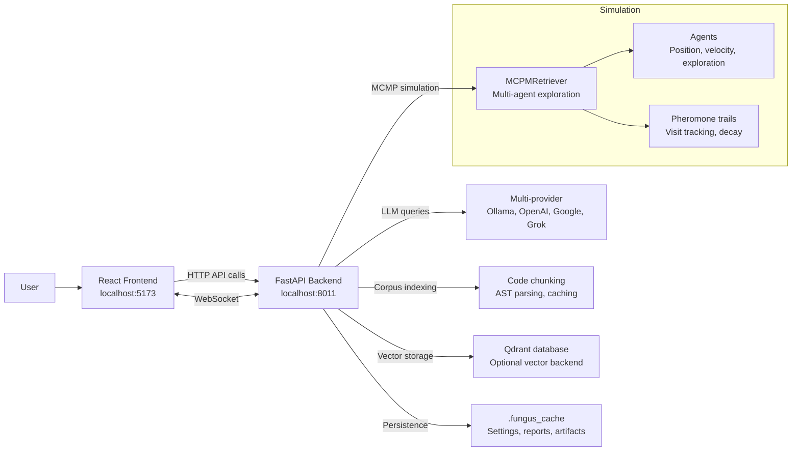
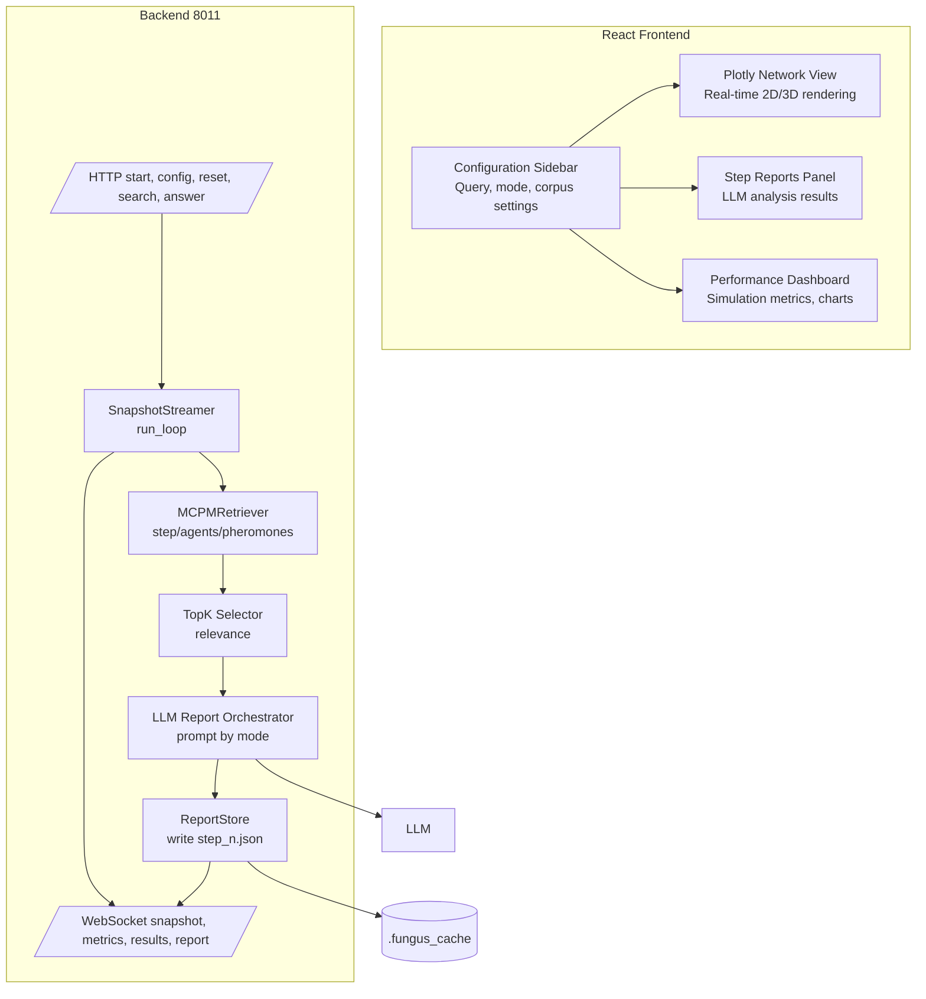
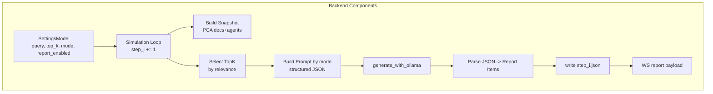

## C4 Diagrams: Per-step LLM Reporting for MCMP

### System Context (Level 1)

### Container (Level 2)

### Component (Level 3)

### Report item (per doc, per step)

- code_chunk: text slice
- content: surrounding/full text used
- file_path: script/module path
- line_range: [start, end]
- code_purpose: brief intent/behavior
- code_dependencies: imports, callers/callees, globals
- file_type: py/test/json/etc.
- embedding_score: similarity to query
- relevance_to_query: rationale
- query_initial: original query string
- follow_up_queries: list derived by LLM
